# SpecTacular Architecture Documentation

**Version:** 1.6.3
**Purpose:** Comprehensive architecture documentation for NotebookLM schema generation

---

## 1. System Overview

SpecTacular is a specification-driven development toolkit consisting of two main components:

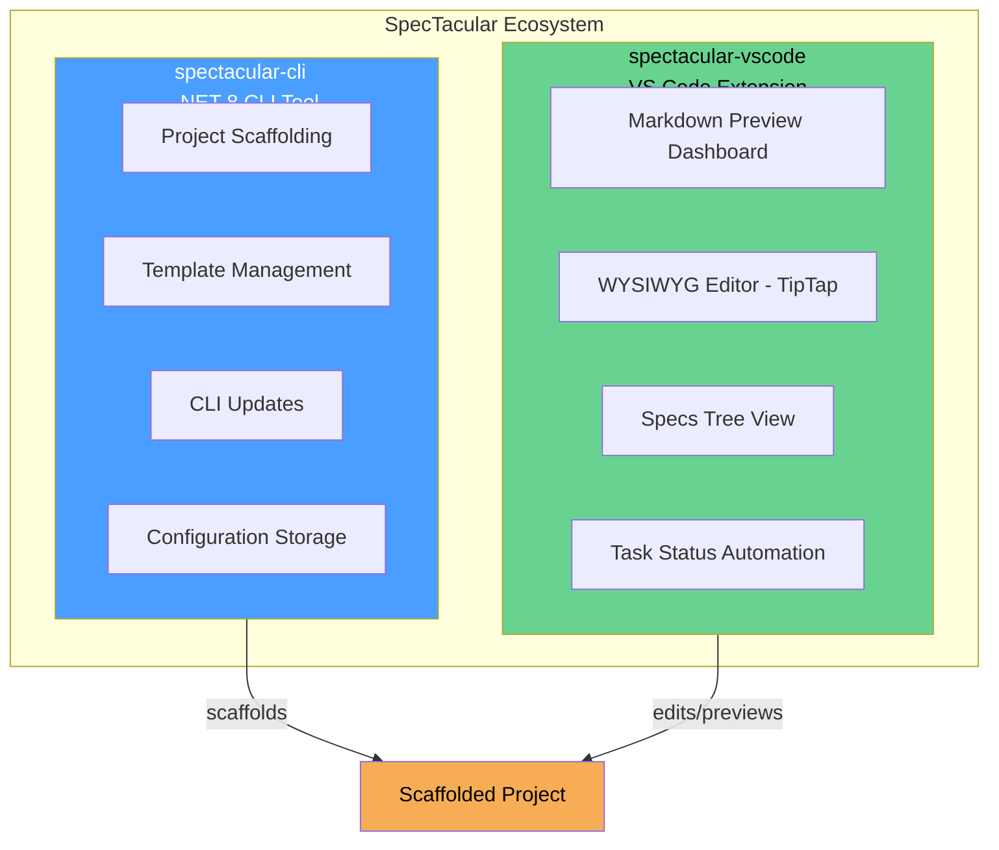

### Component Relationship

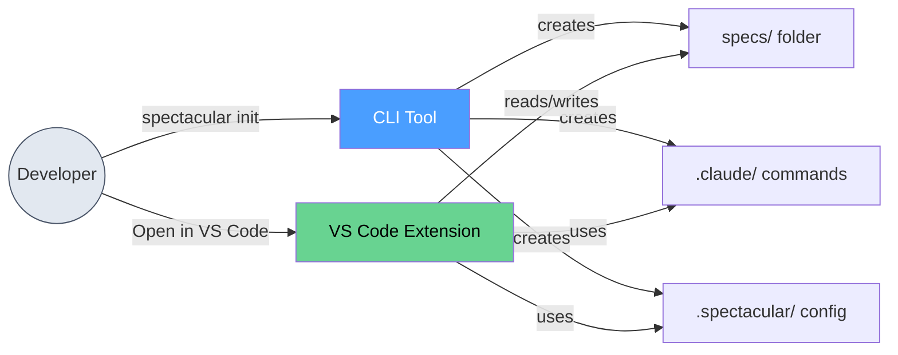

---

## 2. CLI Architecture (spectacular-cli)

### 2.1 Component Diagram

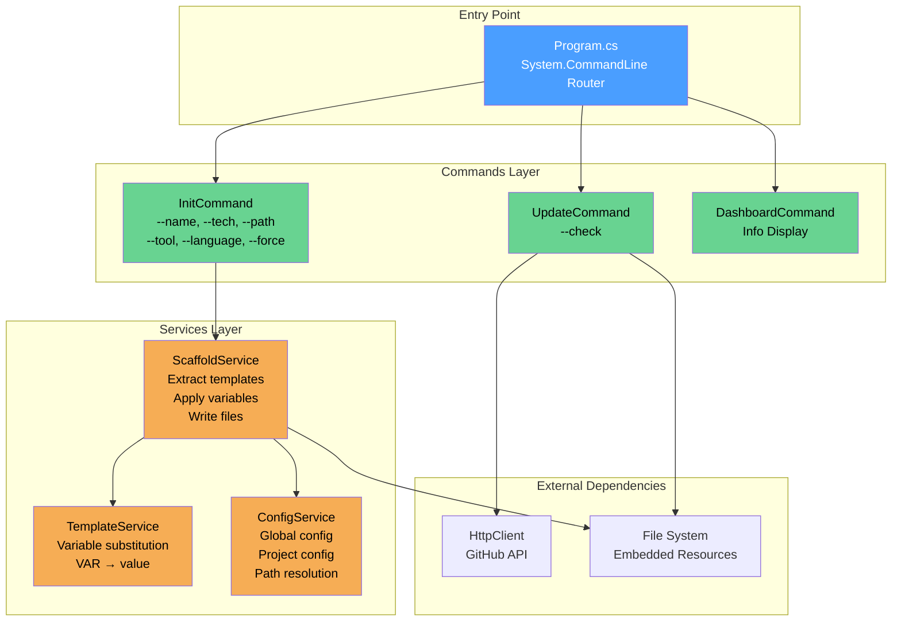

### 2.2 Commands

| Command | File | Purpose | Options |
|---------|------|---------|---------|
| `init` | InitCommand.cs | Scaffold new project | `--name`, `--tech`, `--path`, `--force`, `--tool`, `--language` |
| `update` | UpdateCommand.cs | Check/install updates | `--check` |
| `dashboard` | DashboardCommand.cs | Show extension info | None |

### 2.3 Services

| Service | File | Responsibility |
|---------|------|----------------|
| ScaffoldService | ScaffoldService.cs | Extract embedded templates, apply variables, write files |
| TemplateService | TemplateService.cs | Replace `{{PLACEHOLDER}}` with values |
| ConfigService | ConfigService.cs | Load/save config (global + project level) |

### 2.4 Template Variables

| Variable | Value Source | Example |
|----------|--------------|---------|
| `{{PROJECT_NAME}}` | --name option or directory name | "MyProject" |
| `{{TECH_STACK}}` | --tech option | "ASP.NET Core, React" |
| `{{TECH_STACK_LIST}}` | Formatted tech stack | "- ASP.NET Core\n- React" |
| `{{DATE}}` | Current date | "2024-01-15" |
| `{{LANGUAGE}}` | --language option | "English" |

### 2.5 Configuration Files

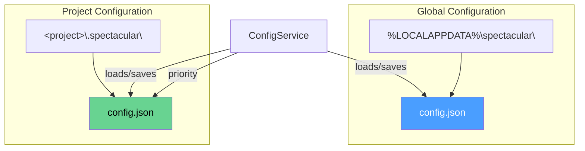

**Config Schema:**
```json
{
  "DashboardPath": "string | null"
}
```

### 2.6 Embedded Resources Structure

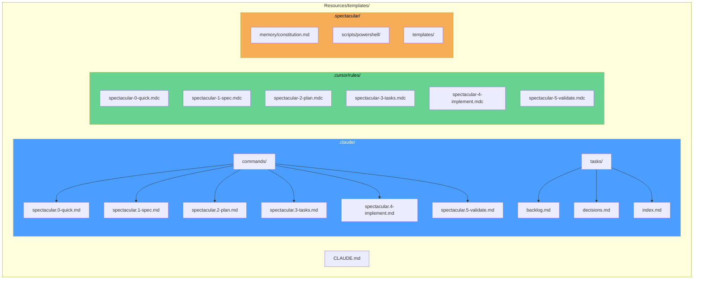

### 2.7 Init Command Flow

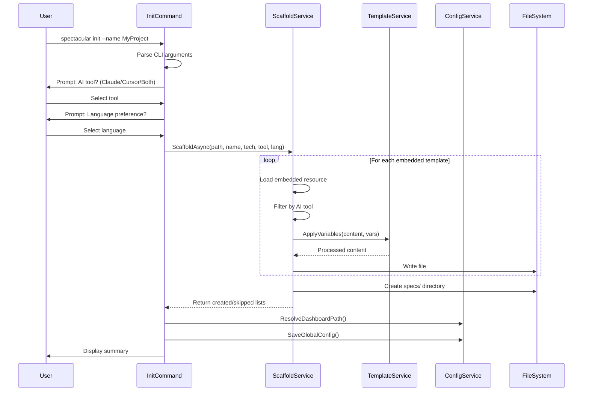

---

## 3. VS Code Extension Architecture (spectacular-vscode)

### 3.1 High-Level Architecture

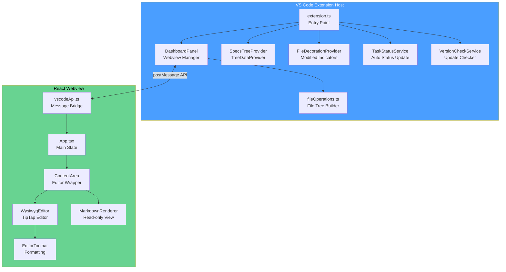

### 3.2 Extension Host Components

#### 3.2.1 extension.ts (Entry Point)

**Activation Events:**
- Extension loaded
- Command executed

**Registered Commands:**

| Command ID | Handler | Purpose |
|------------|---------|---------|
| `spectacular.openDashboard` | Opens dashboard panel | Main dashboard view |
| `spectacular.openDashboardToSide` | Opens beside editor | Side-by-side editing |
| `spectacular.openSpecFile` | Opens file in dashboard | Tree item click |
| `spectacular.refreshTree` | Refreshes tree view | Manual refresh |
| `spectacular.revealSpecs` | Shows specs in explorer | Navigate to folder |
| `spectacular.revealInTree` | Highlights file in tree | Called from webview |
| `spectacular.copyToClipboard` | Copies text | Welcome items |

**Event Listeners:**

| Event | Handler | Purpose |
|-------|---------|---------|
| `onDidChangeActiveTextEditor` | Auto-preview markdown | Show file when opened |
| `createFileSystemWatcher('**/*.md')` | File change detection | Refresh on changes |
| `onDidSaveTextDocument` | Clear modification flag | Update decorations |

#### 3.2.2 DashboardPanel.ts

**Singleton Pattern:** `DashboardPanel.currentPanel`

**Responsibilities:**
- Create/manage WebviewPanel
- Handle message passing
- File operations (read/save)
- File watching with debounce

**Key Methods:**

| Method | Purpose |
|--------|---------|
| `createOrShow()` | Factory method for panel |
| `showFile(filePath)` | Display file in preview |
| `notifyFileChange(filePath)` | Notify webview of disk change |
| `_sendConfig()` | Send initial config to webview |
| `_handleMessage(message)` | Process webview commands |

#### 3.2.3 SpecsTreeProvider.ts

**Implements:** `vscode.TreeDataProvider<TreeItem>`

**Tree Item Types:**

| Type | Purpose | Icon |
|------|---------|------|
| `SpecsTreeItem` | File or folder | Folder/File icon |
| `WelcomeTreeItem` | Empty state message | Info icon |

**Filtering Rules:**
- Shows only markdown files (.md, .markdown)
- Shows folders containing markdown files
- Hides: node_modules, dist, build, out
- Shows: .spectacular folder

#### 3.2.4 FileDecorationProvider.ts

**Purpose:** Visual indicators for modified files

**Decoration:**
```typescript
{
  badge: '●',
  color: 'gitDecoration.modifiedResourceForeground',
  tooltip: 'Modified'
}
```

#### 3.2.5 TaskStatusService.ts

**Purpose:** Automatic task status updates based on acceptance criteria

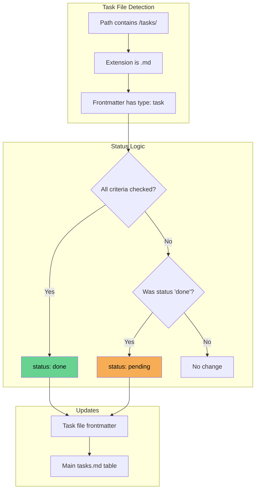

#### 3.2.6 fileOperations.ts

**Functions:**

| Function | Purpose |
|----------|---------|
| `buildFileTree(rootPath)` | Build FileNode tree recursively |
| `readFileContent(filePath)` | Read file as UTF-8 string |
| `isMarkdownFile(filename)` | Check .md/.markdown extension |
| `normalizePath(filePath)` | Convert to forward slashes |

**FileNode Interface:**
```typescript
interface FileNode {
  name: string;
  path: string;
  type: 'file' | 'folder';
  expanded?: boolean;
  children?: FileNode[];
  lastModified?: number;
}
```

### 3.3 Message Protocol

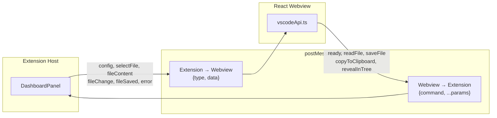

#### Messages: Extension → Webview

| Type | Data | Trigger |
|------|------|---------|
| `config` | `{ rootPath, isWatching, theme, workspaceFolders, versionInfo }` | Ready, theme change |
| `selectFile` | `filePath: string` | Active editor change |
| `fileContent` | `{ path, content }` | readFile response |
| `fileChange` | `{ type, path, timestamp }` | File system watcher |
| `fileSaved` | `{ path, success }` | Save completed |
| `allFilesSaved` | `{ results: [...] }` | Save all completed |
| `watchingStarted` | - | Watcher started |
| `watchingStopped` | - | Watcher stopped |
| `folderSelected` | `path: string` | Directory selected |
| `themeChange` | `'dark' \| 'light'` | VS Code theme changed |
| `error` | `{ message }` | Error occurred |

#### Commands: Webview → Extension

| Command | Data | Purpose |
|---------|------|---------|
| `ready` | - | Webview initialized |
| `readFile` | `{ path }` | Request file content |
| `saveFile` | `{ path, content }` | Save single file |
| `saveAllFiles` | `{ files: [...] }` | Save multiple files |
| `startWatching` | `{ rootPath }` | Begin watching |
| `stopWatching` | - | Stop watching |
| `setWatching` | `{ enabled }` | Toggle watching |
| `selectDirectory` | - | Open folder picker |
| `openExternal` | `{ url }` | Open in browser |
| `copyToClipboard` | `{ text }` | Copy to clipboard |
| `revealInTree` | `{ path }` | Reveal in tree view |

### 3.4 Message Flow Diagram

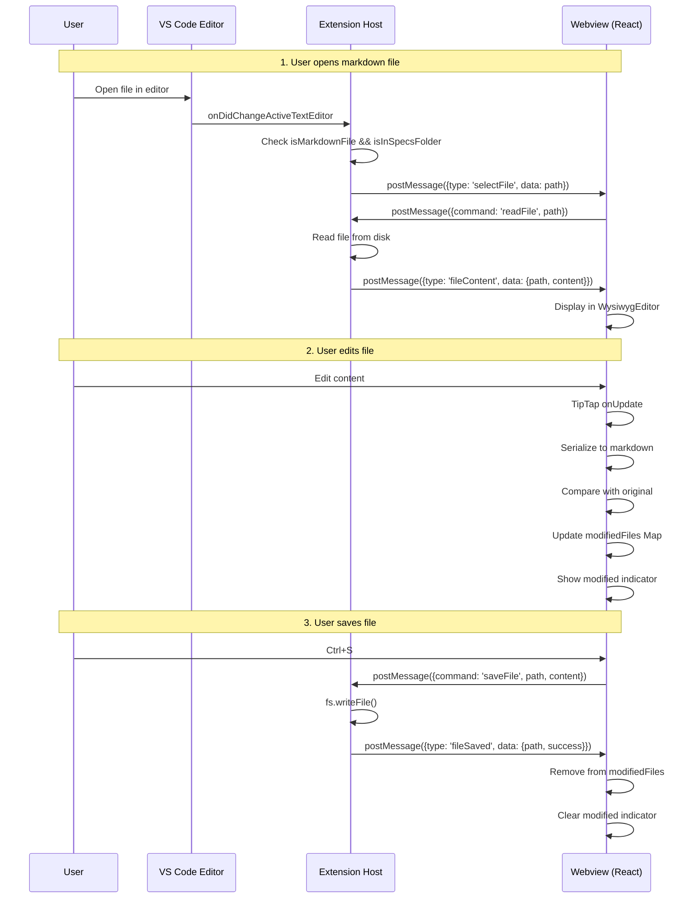

---

## 4. Webview Architecture (React App)

### 4.1 Component Hierarchy

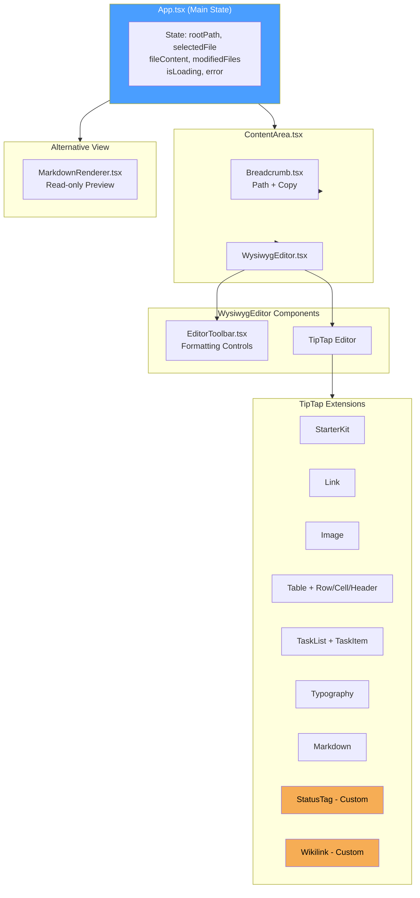

### 4.2 State Management (App.tsx)

| State | Type | Purpose |
|-------|------|---------|
| `rootPath` | `string \| null` | Root directory path |
| `selectedFile` | `string \| null` | Current file path |
| `fileContent` | `string` | Current file content |
| `isLoading` | `boolean` | Loading indicator |
| `error` | `string \| null` | Error message |
| `isReady` | `boolean` | Extension initialized |
| `isWatching` | `boolean` | File watching active |
| `recentFiles` | `RecentFile[]` | Recently opened (max 10) |
| `modifiedFiles` | `Map<string, ModifiedFile>` | Unsaved changes |
| `versionInfo` | `VersionInfo \| null` | Extension version |

### 4.3 Keyboard Shortcuts

| Shortcut | Action |
|----------|--------|
| `Ctrl+S` | Save current file |
| `Ctrl+Shift+S` | Save all modified files |
| `Alt+Left` | Navigate back |
| `Alt+Right` | Navigate forward |
| `Mouse Button 3` | Navigate back |
| `Mouse Button 4` | Navigate forward |

### 4.4 Custom TipTap Extensions

#### StatusTag Extension

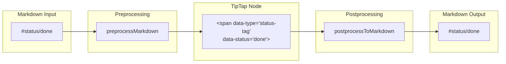

**Supported Values:**

| Status | Display | Icon Color |
|--------|---------|------------|
| `done` | Done | Green |
| `complete` | Complete | Green |
| `pending` | Pending | Gray |
| `in-progress` | In Progress | Blue |
| `blocked` | Blocked | Red |
| `skipped` | Skipped | Gray |

#### Wikilink Extension

**Markdown Syntax:**
- `[[filename]]` → Link to filename.md
- `[[path/to/file]]` → Relative path
- `[[target|Display Text]]` → Custom label

**Path Resolution:**
```
Current file: /specs/feature-a/spec.md
Wikilink: [[../feature-b/spec]]
Resolved: /specs/feature-b/spec.md
```

### 4.5 Markdown Serialization Flow

```mermaid
graph TB
    subgraph Loading["Loading Content"]
        L1[Raw Markdown from file]
        L2[extractFrontmatter]
        L3[preprocessMarkdown]
        L4[TipTap Editor]

        L1 -->|"---yaml---"| L2
        L2 -->|"Store in frontmatterRef"| L3
        L3 -->|"#status/done → span<br/>[[link]] → span"| L4
        L4 -->|"Parse to ProseMirror"| L5[Editor Document]
    end

    subgraph Saving["Saving Content"]
        S1[Editor Document]
        S2[getMarkdown]
        S3[postprocessToMarkdown]
        S4[Reattach frontmatter]
        S5[Final Markdown]

        S1 --> S2
        S2 -->|"Serialize"| S3
        S3 -->|"span → #status/done<br/>span → [[link]]"| S4
        S4 -->|"Prepend YAML"| S5
    end

    style L1 fill:#4a9eff,color:#fff
    style L5 fill:#68d391,color:#000
    style S1 fill:#68d391,color:#000
    style S5 fill:#4a9eff,color:#fff
```

### 4.6 Navigation History

**Hook:** `useNavigationHistory()`

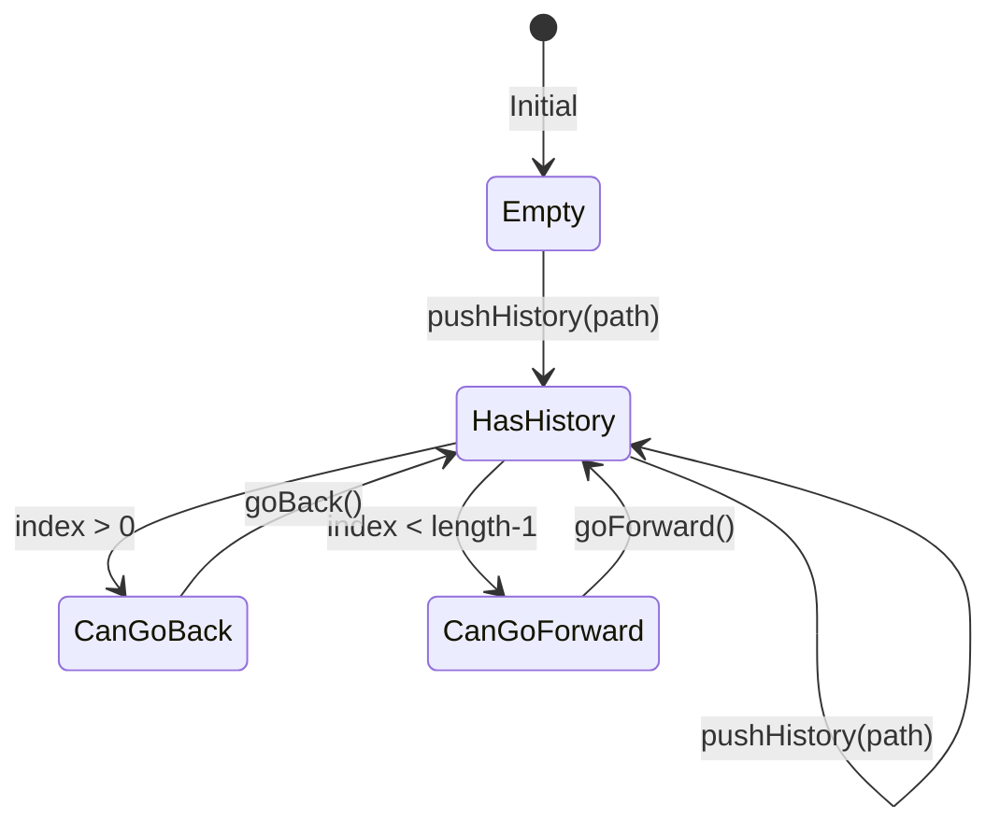

**Operations:**

| Function | Behavior |
|----------|----------|
| `pushHistory(path)` | Add path, truncate forward history |
| `goBack()` | Return path at index-1 |
| `goForward()` | Return path at index+1 |
| `canGoBack` | index > 0 |
| `canGoForward` | index < history.length - 1 |

---

## 5. Scaffolded Project Structure

Created by `spectacular init`:

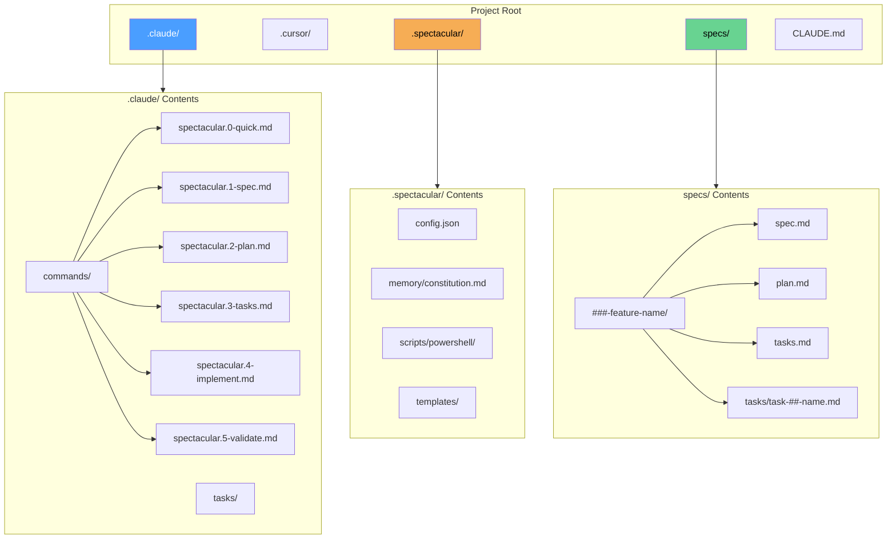

### 5.1 AI Pipeline Commands

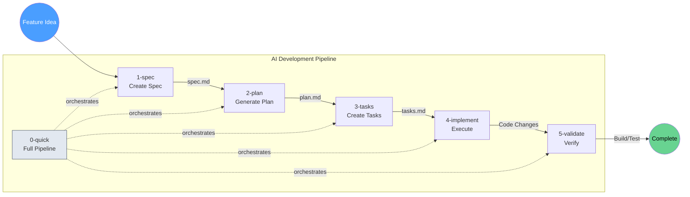

| Stage | Command | Input | Output |
|-------|---------|-------|--------|
| 0 | `0-quick` | Feature description | Complete implementation |
| 1 | `1-spec` | Feature idea | `spec.md` |
| 2 | `2-plan` | `spec.md` | `plan.md` |
| 3 | `3-tasks` | `plan.md` | `tasks.md` + task files |
| 4 | `4-implement` | Tasks | Code changes |
| 5 | `5-validate` | Implementation | Build/test results |

### 5.2 Task File Format

```yaml
---
type: task
status: pending
created: 2024-01-15
---

# Task Title

## Description
Task description here.

## Acceptance Criteria
- [ ] First criterion
- [ ] Second criterion
- [x] Completed criterion

## Notes
Additional notes.
```

**Status Auto-Update Logic:**

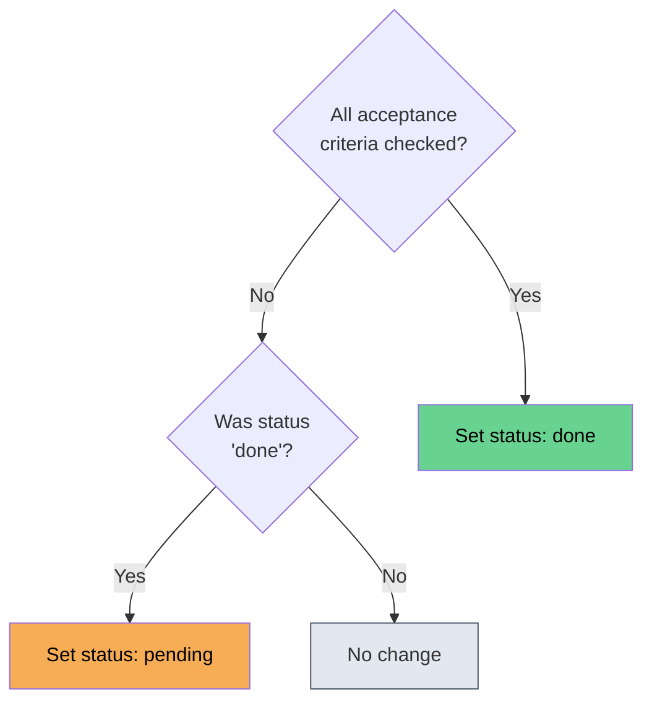

---

## 6. Data Flow Diagrams

### 6.1 Project Initialization Flow

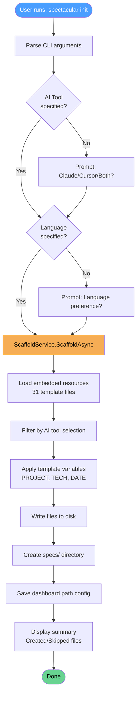

### 6.2 Task Status Update Flow

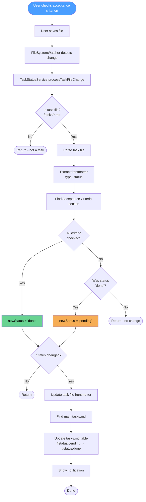

### 6.3 Complete System Data Flow

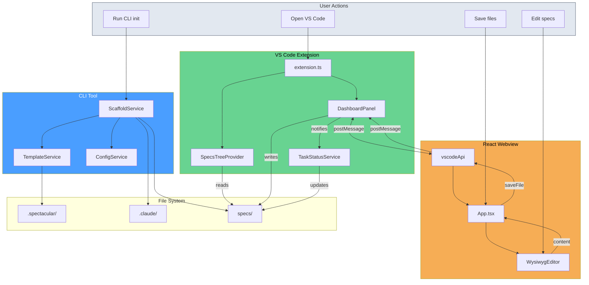

---

## 7. Technology Stack

### CLI (spectacular-cli)

| Layer | Technology |
|-------|------------|
| Runtime | .NET 8 |
| CLI Framework | System.CommandLine 2.0-beta4 |
| JSON | System.Text.Json (source generators) |
| Packaging | Single-file, self-contained executable |
| Updates | GitHub Releases API |

### Extension (spectacular-vscode)

| Layer | Technology |
|-------|------------|
| Extension Host | VS Code Extension API |
| Build | TypeScript, esbuild |
| Webview | React 18, Vite |
| Editor | TipTap 2 (ProseMirror) |
| Styling | Tailwind CSS |
| Markdown | react-markdown, remark-gfm |
| Syntax Highlighting | react-syntax-highlighter |
| Testing | Vitest |

### Technology Relationships

```mermaid
graph TB
    subgraph CLI["CLI Stack"]
        NET[.NET 8]
        CMD[System.CommandLine]
        JSON[System.Text.Json]
        NET --> CMD --> JSON
    end

    subgraph Extension["Extension Stack"]
        VSCODE[VS Code API]
        TS[TypeScript]
        ESBUILD[esbuild]
        VSCODE --> TS --> ESBUILD
    end

    subgraph Webview["Webview Stack"]
        REACT[React 18]
        VITE[Vite]
        TIPTAP[TipTap 2]
        TAILWIND[Tailwind CSS]
        REACT --> VITE
        REACT --> TIPTAP
        REACT --> TAILWIND
    end

    Extension <-->|postMessage| Webview

    style CLI fill:#4a9eff,color:#fff
    style Extension fill:#68d391,color:#000
    style Webview fill:#f6ad55,color:#000
```

### Message Protocol

| Direction | Format |
|-----------|--------|
| Extension → Webview | `{ type: string, data?: unknown }` |
| Webview → Extension | `{ command: string, ...params }` |

---

## 8. Key Files Reference

### CLI Files

| File | Path | Purpose |
|------|------|---------|
| Program.cs | Spectacular.Cli/Program.cs | Entry point |
| InitCommand.cs | Spectacular.Cli/Commands/InitCommand.cs | Init command |
| UpdateCommand.cs | Spectacular.Cli/Commands/UpdateCommand.cs | Update command |
| ScaffoldService.cs | Spectacular.Cli/Services/ScaffoldService.cs | Template extraction |
| TemplateService.cs | Spectacular.Cli/Services/TemplateService.cs | Variable substitution |
| ConfigService.cs | Spectacular.Cli/Services/ConfigService.cs | Configuration |

### Extension Files

| File | Path | Purpose |
|------|------|---------|
| extension.ts | src/extension.ts | Extension entry |
| DashboardPanel.ts | src/DashboardPanel.ts | Webview manager |
| SpecsTreeProvider.ts | src/SpecsTreeProvider.ts | Tree view |
| FileDecorationProvider.ts | src/FileDecorationProvider.ts | Decorations |
| TaskStatusService.ts | src/TaskStatusService.ts | Task automation |
| fileOperations.ts | src/fileOperations.ts | File utilities |

### Webview Files

| File | Path | Purpose |
|------|------|---------|
| App.tsx | webview/src/App.tsx | Main component |
| vscodeApi.ts | webview/src/vscodeApi.ts | VS Code bridge |
| ContentArea.tsx | webview/src/components/ContentArea.tsx | Editor wrapper |
| WysiwygEditor.tsx | webview/src/components/editor/WysiwygEditor.tsx | TipTap editor |
| EditorToolbar.tsx | webview/src/components/editor/EditorToolbar.tsx | Formatting toolbar |
| MarkdownRenderer.tsx | webview/src/components/MarkdownRenderer.tsx | Preview renderer |
| StatusTag.ts | webview/src/components/editor/extensions/StatusTag.ts | Status extension |
| Wikilink.ts | webview/src/components/editor/extensions/Wikilink.ts | Wikilink extension |

### File Dependencies

```mermaid
graph LR
    subgraph CLI["CLI Dependencies"]
        PC[Program.cs] --> IC[InitCommand.cs]
        PC --> UC[UpdateCommand.cs]
        IC --> SS[ScaffoldService.cs]
        SS --> TS[TemplateService.cs]
        SS --> CS[ConfigService.cs]
    end

    subgraph Extension["Extension Dependencies"]
        EXT[extension.ts] --> DP[DashboardPanel.ts]
        EXT --> STP[SpecsTreeProvider.ts]
        EXT --> TSS[TaskStatusService.ts]
        DP --> FO[fileOperations.ts]
    end

    subgraph Webview["Webview Dependencies"]
        APP[App.tsx] --> CA[ContentArea.tsx]
        CA --> WE[WysiwygEditor.tsx]
        WE --> TB[EditorToolbar.tsx]
        WE --> ST[StatusTag.ts]
        WE --> WL[Wikilink.ts]
        APP --> API[vscodeApi.ts]
    end
```

---

## 9. Configuration Reference

### VS Code Settings

| Setting | Default | Purpose |
|---------|---------|---------|
| `spectacular.watchDebounceMs` | 300 | File change debounce (ms) |
| `spectacular.autoOpen` | false | Auto-open dashboard on startup |
| `spectacular.autoPreview` | true | Auto-preview on file open |

### CLI Configuration

**Global config:** `%LOCALAPPDATA%\spectacular\config.json`
```json
{
  "DashboardPath": "C:\\path\\to\\dashboard.exe"
}
```

**Project config:** `.spectacular\config.json`
```json
{
  "DashboardPath": null
}
```

---

## 10. Glossary

| Term | Definition |
|------|------------|
| **Specs** | Specification documents in markdown format |
| **Dashboard** | VS Code webview for previewing/editing specs |
| **Pipeline** | Sequential AI commands (1-spec → 2-plan → 3-tasks → 4-implement → 5-validate) |
| **Status Tag** | Inline markdown syntax (`#status/done`) for task status |
| **Wikilink** | Double-bracket links (`[[filename]]`) for navigation |
| **Task File** | Markdown file with frontmatter and acceptance criteria |
| **Frontmatter** | YAML metadata at start of markdown files (`---...---`) |
| **Constitution** | Project principles document in `.spectacular/memory/` |

---

## 11. Diagram Index

Quick reference to all Mermaid diagrams in this document:

| Section | Diagram | Type | Description |
|---------|---------|------|-------------|
| 1 | System Overview | graph TB | High-level ecosystem |
| 1 | Component Relationship | graph LR | CLI + Extension relationship |
| 2.1 | CLI Components | graph TB | Commands and services |
| 2.5 | Configuration Files | graph TB | Config file locations |
| 2.6 | Embedded Resources | graph TB | Template file structure |
| 2.7 | Init Command Flow | sequenceDiagram | Initialization sequence |
| 3.1 | Extension Architecture | graph TB | VS Code extension components |
| 3.2.5 | Task Status Logic | graph TB | Status detection flow |
| 3.3 | Message Protocol | graph LR | Extension ↔ Webview messages |
| 3.4 | Message Flow | sequenceDiagram | Complete message sequence |
| 4.1 | Component Hierarchy | graph TB | React component tree |
| 4.4 | StatusTag Flow | graph LR | Markdown ↔ HTML conversion |
| 4.5 | Serialization Flow | graph TB | Load/save content flow |
| 4.6 | Navigation History | stateDiagram-v2 | History state machine |
| 5 | Project Structure | graph TB | Scaffolded file tree |
| 5.1 | AI Pipeline | graph LR | Development pipeline |
| 5.2 | Status Update Logic | graph TD | Auto-status decision tree |
| 6.1 | Init Flow | flowchart TD | Complete init process |
| 6.2 | Task Status Flow | flowchart TD | Task update process |
| 6.3 | System Data Flow | flowchart TB | Complete system overview |
| 7 | Technology Stack | graph TB | Tech relationships |
| 8 | File Dependencies | graph LR | Source file dependencies |

---

*End of Architecture Documentation*
