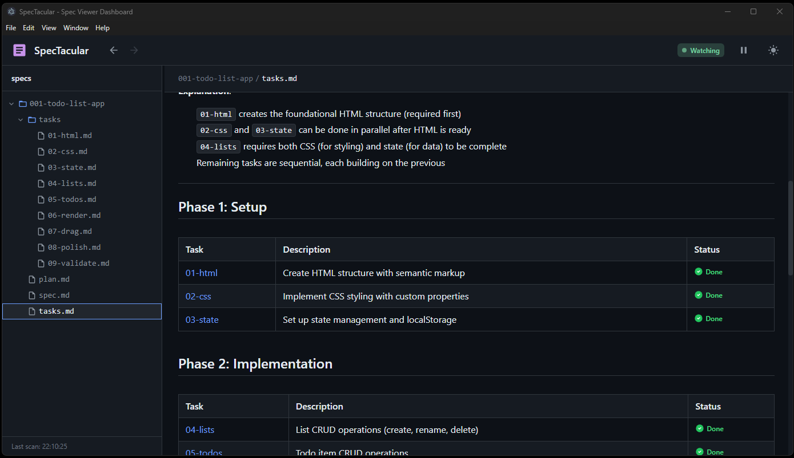

# SpecTacular



A markdown specification viewer - an Electron desktop application for previewing and monitoring markdown specification files with real-time filesystem watching.

## Why SpecTacular?

Managing software specifications across multiple markdown files can be challenging:

- **Fragmented documentation** - Specs, plans, and tasks spread across many files
- **No visual hierarchy** - Plain text editors don't show document relationships
- **Manual navigation** - Jumping between linked files is tedious
- **No status visibility** - Task completion states buried in text

SpecTacular solves these problems by providing:

- **Unified file tree** - Browse all spec files in a navigable sidebar
- **Real-time watching** - Files update automatically when changed on disk
- **Wikilink navigation** - Click `[[links]]` to jump between documents
- **Visual status tags** - `#status/done`, `#status/pending` render as colored icons
- **Dark/light themes** - Comfortable viewing in any environment
- **Syntax highlighting** - Code blocks with language-aware formatting

## Quick Start

### Prerequisites

- Node.js 18+
- npm or yarn

### Installation

```bash
# Clone the repository
git clone https://github.com/yourusername/spectacular.git
cd spectacular

# Install dependencies
cd spectacular-dashboard
npm install

# Run in development mode
npm run dev
```

### Build for Production

```bash
# Full build with installer
npm run build

# The installer will be created at:
# release/SpecTacular Setup 1.0.0.exe (Windows)
```

## Usage

1. **Launch SpecTacular** - Run the application
2. **Open a folder** - Select a directory containing your markdown specs
3. **Browse files** - Use the sidebar file tree to navigate
4. **Click wikilinks** - `[[document-name]]` links navigate between files
5. **Track status** - Status tags like `#status/done` display as visual icons

## Markdown Features

### Status Tags

Visual indicators for task and feature status:

| Tag | Display | Use For |
|-----|---------|---------|
| `#status/done` | Green checkmark | Completed tasks |
| `#status/complete` | Green checkmark | Finished features |
| `#status/pending` | Gray circle | Not started |
| `#status/in-progress` | Blue half-circle | Currently working |
| `#status/blocked` | Red X | Blocked items |
| `#status/skipped` | Gray arrow | Intentionally skipped |

### Wikilinks

Link between documents using double brackets:

```markdown
See the [[implementation-plan]] for details.
Related: [[task-01-setup]], [[task-02-implement]]
```

### Task Links

Links matching `task-\d+` patterns show a copy button on hover for easy reference.

## Project Structure

```
spectacular/
├── spectacular-dashboard/    # Main Electron + React application
│   ├── electron/            # Main process (IPC, file watching)
│   ├── src/                 # React renderer
│   │   ├── components/      # UI components
│   │   ├── hooks/           # Custom React hooks
│   │   └── contexts/        # Theme context
│   └── release/             # Built installers
├── .spectacular/            # Configuration and templates
│   ├── examples/            # Example spec files
│   └── templates/           # Document templates
└── images/                  # Project images
```

## Recommended Spec Structure

Organize your specifications in feature folders:

```
specs/
├── 001-user-authentication/
│   ├── spec.md              # Feature specification
│   ├── plan.md              # Implementation plan
│   ├── tasks.md             # Task checklist with status
│   └── task-01-setup.md     # Individual task details
├── 002-dashboard-ui/
│   └── ...
```

## Tech Stack

- **Frontend**: React 18 + TypeScript + Vite
- **Desktop**: Electron 28
- **Styling**: Tailwind CSS
- **File Watching**: chokidar
- **Markdown**: react-markdown + remark-gfm

## Development

```bash
# Development with hot reload
npm run dev

# Run tests
npm run test

# Lint code
npm run lint

# Build only Vite (no Electron)
npm run build:vite
```

## License

MIT
