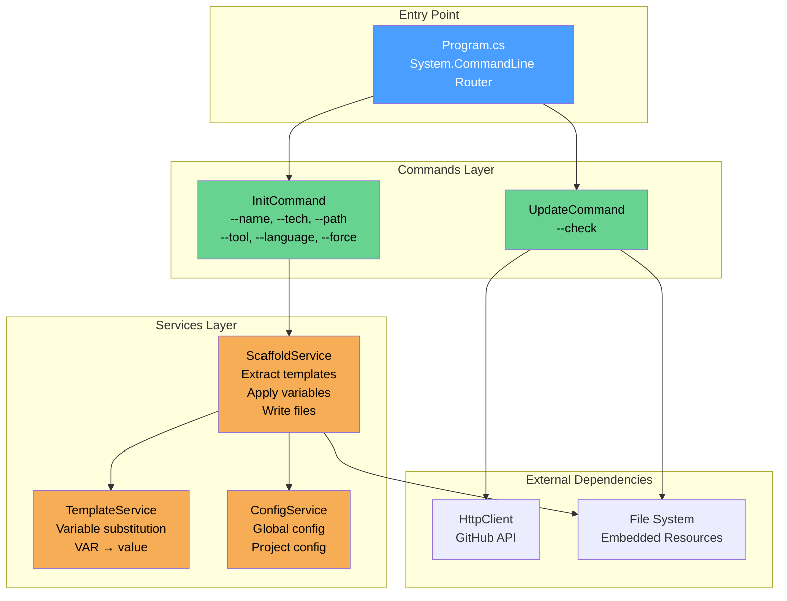
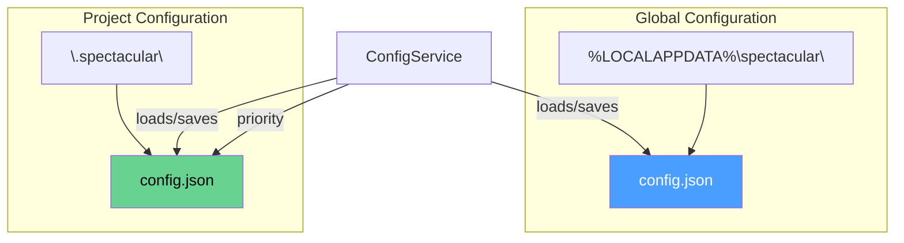
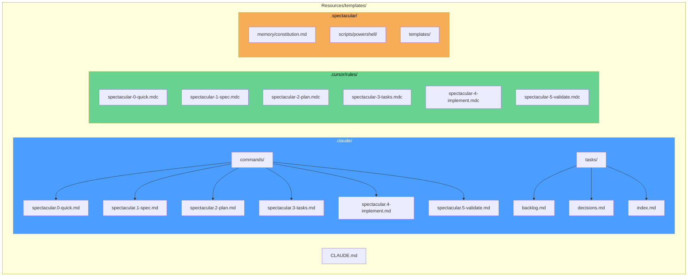
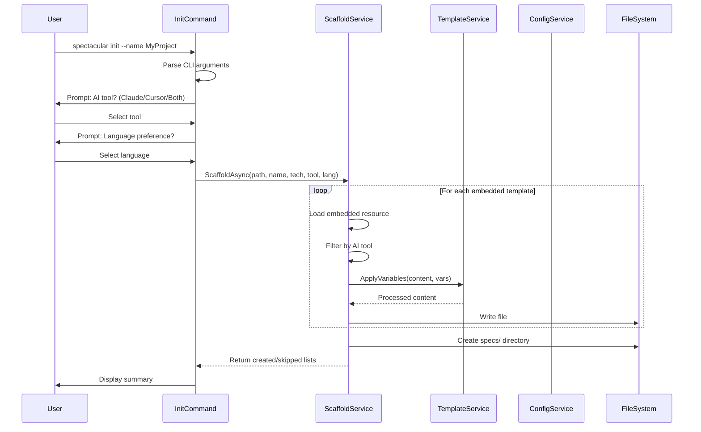

# CLI Architecture

The SpecTacular CLI is a .NET 8 command-line tool built with the Command Pattern and Service Layer architecture.

**Location:** `spectacular-cli/Spectacular.Cli/`

## Component Diagram



## Commands

### InitCommand.cs

**Purpose:** Scaffold a new SpecTacular project

**File:** `Commands/InitCommand.cs`

**Options:**

| Option | Type | Description | Default |
|--------|------|-------------|---------|
| `--name` | string | Project name | Directory name |
| `--tech` | string | Technology stack (comma-separated) | None |
| `--path` | string | Target directory | Current directory |
| `--force` | bool | Overwrite existing files | `false` |
| `--tool` | string | AI tool (claude, cursor, both) | `both` |
| `--language` | string | Language (en, sk) | `en` |

**Workflow:**
1. Parse command-line arguments
2. Prompt for missing options (tool, language)
3. Call `ScaffoldService.ScaffoldAsync()`
4. Display summary of created files

### UpdateCommand.cs

**Purpose:** Check for and install updates from GitHub

**File:** `Commands/UpdateCommand.cs`

**Options:**

| Option | Type | Description |
|--------|------|-------------|
| `--check` | bool | Only check for updates (don't install) |

**Workflow:**
1. Get current version from assembly
2. Fetch latest release from GitHub API
3. Compare versions (semantic versioning)
4. Download and replace executable if update available
5. Update PATH configuration

## Services

### ScaffoldService.cs

**Purpose:** Extract embedded templates and scaffold project structure

**File:** `Services/ScaffoldService.cs`

**Key Methods:**

```csharp
Task<ScaffoldResult> ScaffoldAsync(
    string targetPath,
    string projectName,
    string? techStack,
    string tool,
    string language
)
```

**Process:**
1. Load embedded resources from `Resources/templates/`
2. Filter templates based on AI tool selection
3. Apply variable substitution via `TemplateService`
4. Write files to target directory
5. Create `specs/` directory
6. Return list of created/skipped files

**Embedded Resources:**

All templates are compiled into the executable as embedded resources with Build Action: `EmbeddedResource`.

Resource naming format: `Resources.templates.path.to.file.ext`

Example: `Resources.templates.CLAUDE.md` → `CLAUDE.md`

### TemplateService.cs

**Purpose:** Replace template variables with actual values

**File:** `Services/TemplateService.cs`

**Key Method:**

```csharp
string ApplyVariables(string content, Dictionary<string, string> variables)
```

**Template Variables:**

| Variable | Value Source | Example |
|----------|--------------|---------|
| `{{PROJECT_NAME}}` | --name option or directory name | "MyProject" |
| `{{TECH_STACK}}` | --tech option | "ASP.NET Core, React" |
| `{{TECH_STACK_LIST}}` | Formatted tech stack | "- ASP.NET Core\n- React" |
| `{{DATE}}` | Current date (ISO 8601) | "2024-12-22" |
| `{{LANGUAGE}}` | --language option | "English" or "Slovak" |

**Example:**

```markdown
---
project: {{PROJECT_NAME}}
created: {{DATE}}
---

# {{PROJECT_NAME}} Specifications

## Tech Stack
{{TECH_STACK_LIST}}
```

Becomes:

```markdown
---
project: MyApp
created: 2024-12-22
---

# MyApp Specifications

## Tech Stack
- Node.js
- TypeScript
- React
```

### ConfigService.cs

**Purpose:** Manage global and project-level configuration

**File:** `Services/ConfigService.cs`

**Key Methods:**

```csharp
Task<Config> LoadGlobalConfigAsync()
Task<Config> LoadProjectConfigAsync(string projectPath)
Task SaveConfigAsync(Config config, string path)
```

**Configuration Priority:**

Project config overrides global config.

## Configuration Files



**Global Config Location:**
- Windows: `%LOCALAPPDATA%\spectacular\config.json` (`~\.spectacular\config.json`)
- Linux/macOS: `~/.spectacular/config.json`

**Project Config Location:**
- `<project>/.spectacular/config/project.json`

**Config Schema:**

```json
{
  "projectName": "MyProject",
  "techStack": ["Node.js", "TypeScript"],
  "language": "en",
  "tool": "both",
  "version": "1.6.4",
  "initialized": "2024-12-22T10:00:00Z"
}
```

## Embedded Resources Structure



**Embedded Resources:**

All files in `Resources/templates/` are embedded in the compiled executable:

- **Claude Code commands** (`.claude/commands/*.md`)
- **Cursor rules** (`.cursor/rules/*.md`)
- **Templates** (`.spectacular/templates/*.md`)
- **Prompts** (`.spectacular/prompts/*.md`)
- **Scripts** (`.spectacular/scripts/**/*.ps1`)
- **Root files** (`CLAUDE.md`)

**Build Configuration:**

```xml
<ItemGroup>
  <EmbeddedResource Include="Resources\templates\**\*" />
</ItemGroup>
```

## Init Command Flow



**Process Details:**

1. **Parse Arguments** - Extract options from command line
2. **Interactive Prompts** - Ask for missing required info
3. **Load Templates** - Extract from embedded resources
4. **Filter by Tool** - Include only selected AI tool templates
5. **Apply Variables** - Replace `{{PLACEHOLDERS}}`
6. **Write Files** - Create directory structure and files
7. **Display Summary** - Show created files count

## File Structure

```
spectacular-cli/
├── Spectacular.Cli/              # Main project
│   ├── Commands/
│   │   ├── InitCommand.cs        # Init command implementation
│   │   └── UpdateCommand.cs      # Update command implementation
│   ├── Services/
│   │   ├── ScaffoldService.cs    # Scaffolding logic
│   │   ├── TemplateService.cs    # Variable substitution
│   │   └── ConfigService.cs      # Configuration management
│   ├── Resources/
│   │   └── templates/            # Embedded templates
│   │       ├── .claude/
│   │       ├── .cursor/
│   │       ├── .spectacular/
│   │       └── CLAUDE.md
│   ├── Program.cs                # Entry point
│   └── Spectacular.Cli.csproj    # Project file
├── Spectacular.Cli.Tests/        # Unit tests
│   └── ...
└── installer/
    └── install.ps1               # PowerShell installer
```

## Key Files

| File | Location | Purpose |
|------|----------|---------|
| `Program.cs` | Root | Entry point, command router |
| `InitCommand.cs` | Commands/ | Init command logic |
| `UpdateCommand.cs` | Commands/ | Update command logic |
| `ScaffoldService.cs` | Services/ | Template extraction and scaffolding |
| `TemplateService.cs` | Services/ | Variable substitution |
| `ConfigService.cs` | Services/ | Configuration management |

## Build and Deployment

### Build Configuration

**Target Framework:** .NET 8.0

**Output Type:** Executable (Console Application)

**Publish Settings:**

```xml
<PropertyGroup>
  <PublishSingleFile>true</PublishSingleFile>
  <SelfContained>true</SelfContained>
  <PublishTrimmed>true</PublishTrimmed>
  <RuntimeIdentifier>win-x64</RuntimeIdentifier>
</PropertyGroup>
```

### Build Commands

```powershell
# Development build
dotnet build

# Release build
dotnet build -c Release

# Publish single-file executable
dotnet publish -c Release -r win-x64 -o ../publish/win-x64
```

### Testing

```powershell
# Run all tests
dotnet test

# Run with coverage
dotnet test --collect:"XPlat Code Coverage"
```

## Design Patterns

### Command Pattern

Each CLI command is a separate class implementing the command pattern:

- `InitCommand` - Handles `init` command
- `UpdateCommand` - Handles `update` command

Benefits:
- Easy to add new commands
- Isolated command logic
- Testable independently

### Service Layer

Business logic is separated into services:

- `ScaffoldService` - Scaffolding operations
- `TemplateService` - Template processing
- `ConfigService` - Configuration management

Benefits:
- Reusable logic
- Single responsibility
- Easy to mock for testing

### Embedded Resources

Templates are embedded in the executable:

Benefits:
- ✅ No external dependencies
- ✅ Single-file distribution
- ✅ Version-locked templates
- ⚠️ Larger executable size (~2MB)

## Error Handling

### Exit Codes

| Code | Meaning |
|------|---------|
| 0 | Success |
| 1 | General error |
| 2 | Invalid arguments |
| 3 | File system error |
| 4 | Network error (update) |
| 5 | Already initialized (without --force) |

### Common Errors

**Already initialized:**
```
Error: SpecTacular is already initialized in this directory.
Use --force to overwrite existing files.
```

**Network error:**
```
Error: Failed to check for updates.
Check your internet connection.
```

**File system error:**
```
Error: Failed to create directory: <path>
Check permissions.
```

## Next Steps

- [Extension Architecture](./extension) - VS Code extension details
- [Webview Architecture](./webview) - React UI architecture
- [Message Protocol](./message-protocol) - Communication patterns
- [Data Flow](./data-flow) - End-to-end workflows
