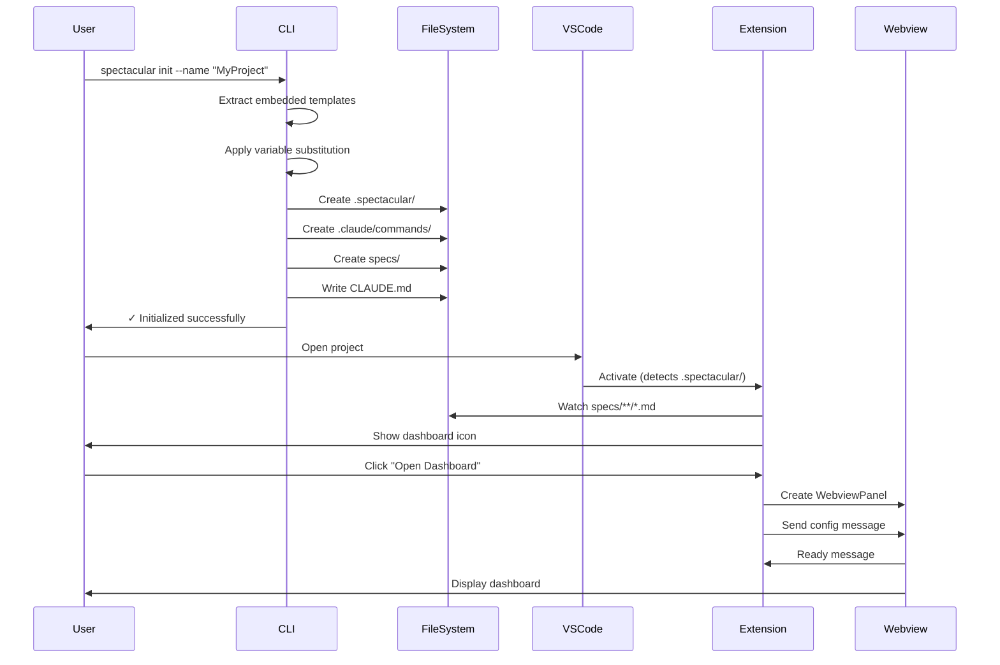
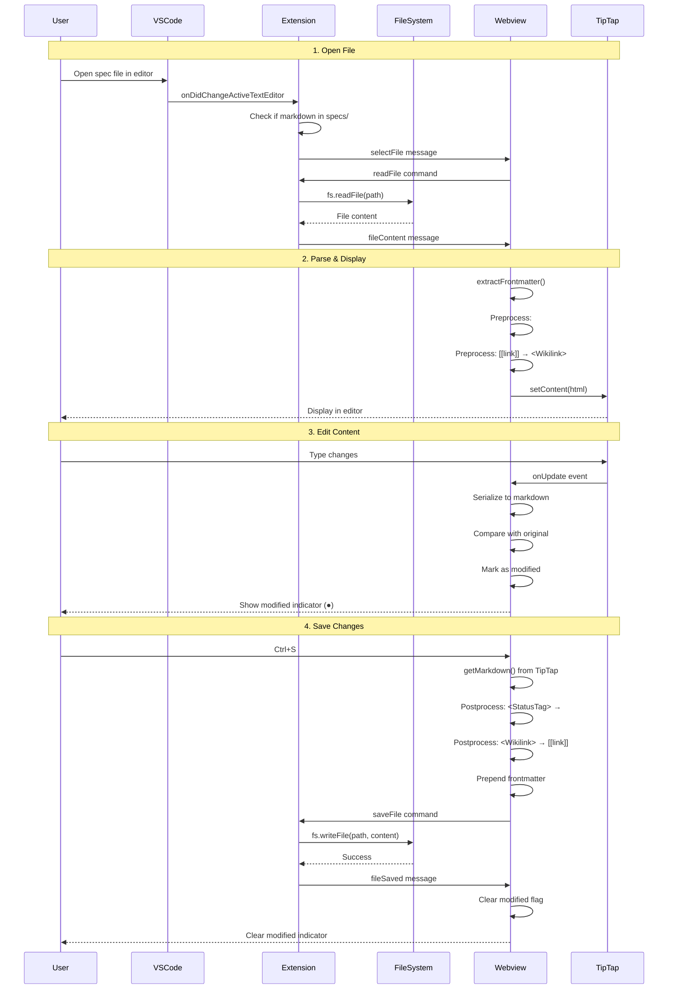
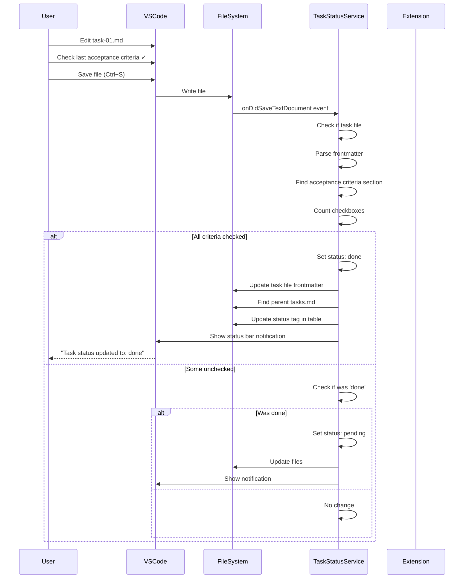
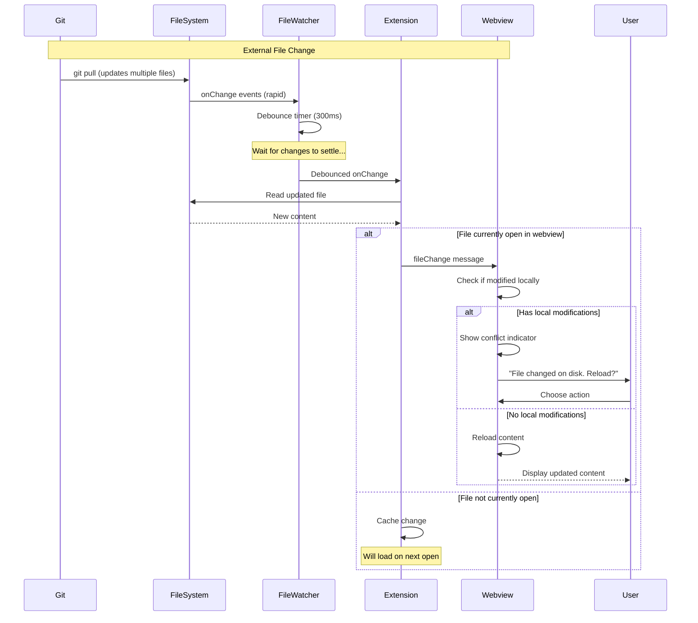
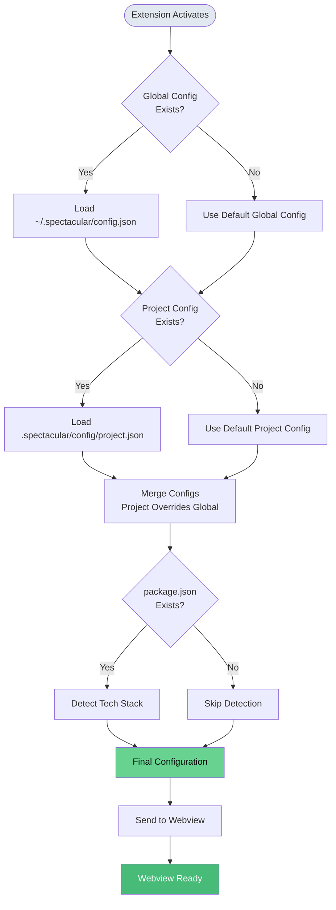

# Data Flow

This page documents the key data flows and workflows in SpecTacular.

## Project Initialization Flow

The complete flow from CLI installation to first spec.



## File Editing Workflow

Complete cycle from opening a file to saving edits.



## Task Status Auto-Update Flow

Automatic status updates when acceptance criteria are checked.



## File Watching Flow

Real-time updates from external file changes (e.g., git pull).



## AI Workflow Pipeline

Specification-driven development workflow using AI commands.

```mermaid
graph TB
    START([User: New Feature Request])

    START --> SPEC[/spec: Create Specification]
    SPEC --> SPEC_FILE[specs/###-feature/spec.md]

    SPEC_FILE --> PLAN[/plan: Create Implementation Plan]
    PLAN --> PLAN_FILE[specs/###-feature/plan.md]

    PLAN_FILE --> TASKS[/tasks: Break Down into Tasks]
    TASKS --> TASKS_FILE[specs/###-feature/tasks.md]
    TASKS --> TASK_FILES[specs/###-feature/task-01.md<br/>task-02.md, ...]

    TASK_FILES --> IMPLEMENT[/implement: Code Implementation]
    IMPLEMENT --> CODE[Source Code Changes]

    CODE --> VALIDATE[/validate: Review & Test]
    VALIDATE --> DECISION{All Valid?}

    DECISION -->|Yes| DONE([Feature Complete])
    DECISION -->|No| IMPLEMENT

    style START fill:#e2e8f0
    style SPEC fill:#4a9eff,color:#fff
    style PLAN fill:#68d391,color:#000
    style TASKS fill:#f6ad55,color:#000
    style IMPLEMENT fill:#fc8181,color:#fff
    style VALIDATE fill:#9f7aea,color:#fff
    style DONE fill:#48bb78,color:#fff
```

## Configuration Loading Flow

How configuration is loaded and merged.



## State Management

### Extension Host State

**Persistent:**
- Global configuration (`~/.spectacular/config.json`)
- Workspace state (VS Code `workspaceState`)

**Runtime:**
- File watcher instances
- Dashboard panel instance (singleton)
- Modified files tracking
- Navigation history

### Webview State

**Persisted (via `vscodeApi.setState()`):**
```typescript
{
  currentFile: string | null;
  modifiedFiles: [string, string][]; // Map entries
  navigationHistory: string[];
  historyIndex: number;
}
```

**Runtime (React state):**
```typescript
{
  rootPath: string | null;
  fileContent: string;
  isLoading: boolean;
  error: string | null;
  theme: 'light' | 'dark';
  isWatching: boolean;
}
```

## Error Propagation

### Extension → Webview

```typescript
try {
  const content = await fs.readFile(filePath, 'utf8');
  panel.webview.postMessage({
    type: 'fileContent',
    data: { path: filePath, content }
  });
} catch (error) {
  panel.webview.postMessage({
    type: 'error',
    data: {
      message: `Failed to read file: ${error.message}`,
      code: 'READ_ERROR',
      path: filePath
    }
  });
}
```

### Webview → User

```typescript
useEffect(() => {
  const handleMessage = (event: MessageEvent) => {
    if (event.data.type === 'error') {
      setError(event.data.data.message);
      // Show error in UI
      toast.error(event.data.data.message);
    }
  };

  window.addEventListener('message', handleMessage);
  return () => window.removeEventListener('message', handleMessage);
}, []);
```

## Performance Optimizations

### Debouncing

| Operation | Delay | Reason |
|-----------|-------|--------|
| File watcher | 300ms | Batch rapid changes (git pull) |
| Search input | 500ms | Reduce search queries |
| Auto-save (disabled) | N/A | Manual save only (Ctrl+S) |

### Lazy Loading

| Resource | Strategy |
|----------|----------|
| File tree | Load on demand (expand folder) |
| File content | Load when selected |
| Markdown rendering | Render visible content only |
| Images | Lazy load images in preview |

### Caching

| Data | Cache Location | Invalidation |
|------|----------------|--------------|
| File tree | Extension host memory | File watcher events |
| File content | Webview state | File change events |
| Rendered markdown | TipTap document | Content change |
| Configuration | Extension host | Config file change |

## Next Steps

- [CLI Architecture](./cli) - CLI tool details
- [Extension Architecture](./extension) - Extension host architecture
- [Webview Architecture](./webview) - React UI architecture
- [Message Protocol](./message-protocol) - Communication details
- [Overview](./index) - System overview
