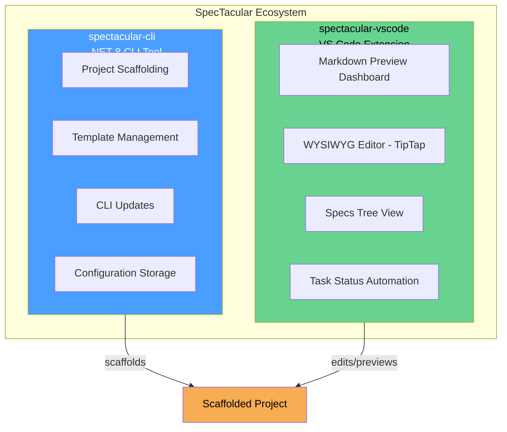
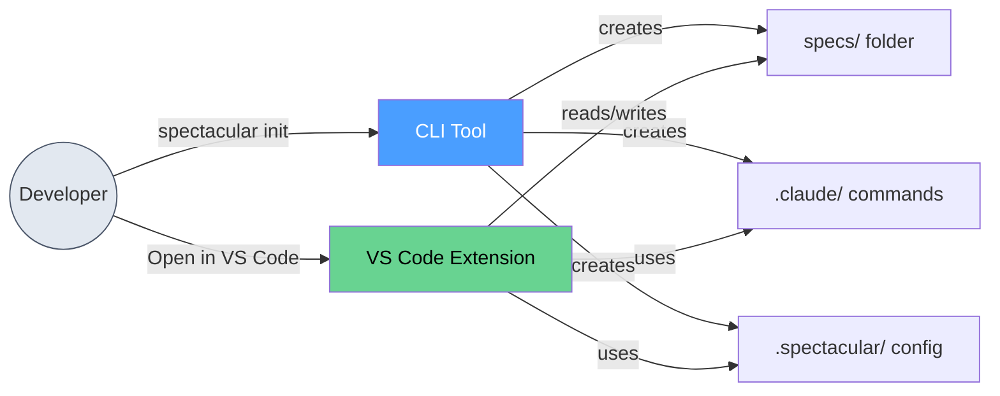
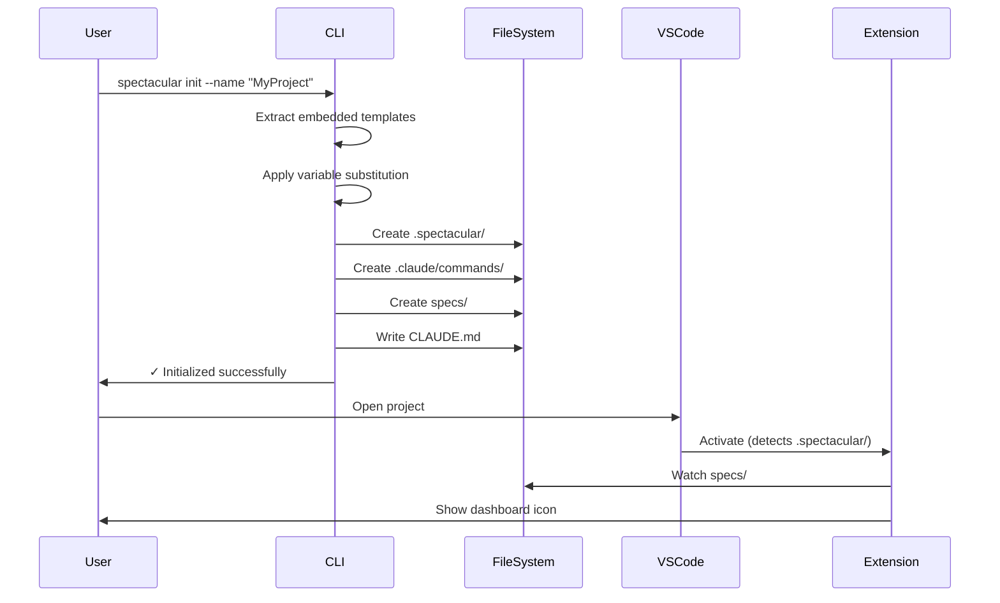
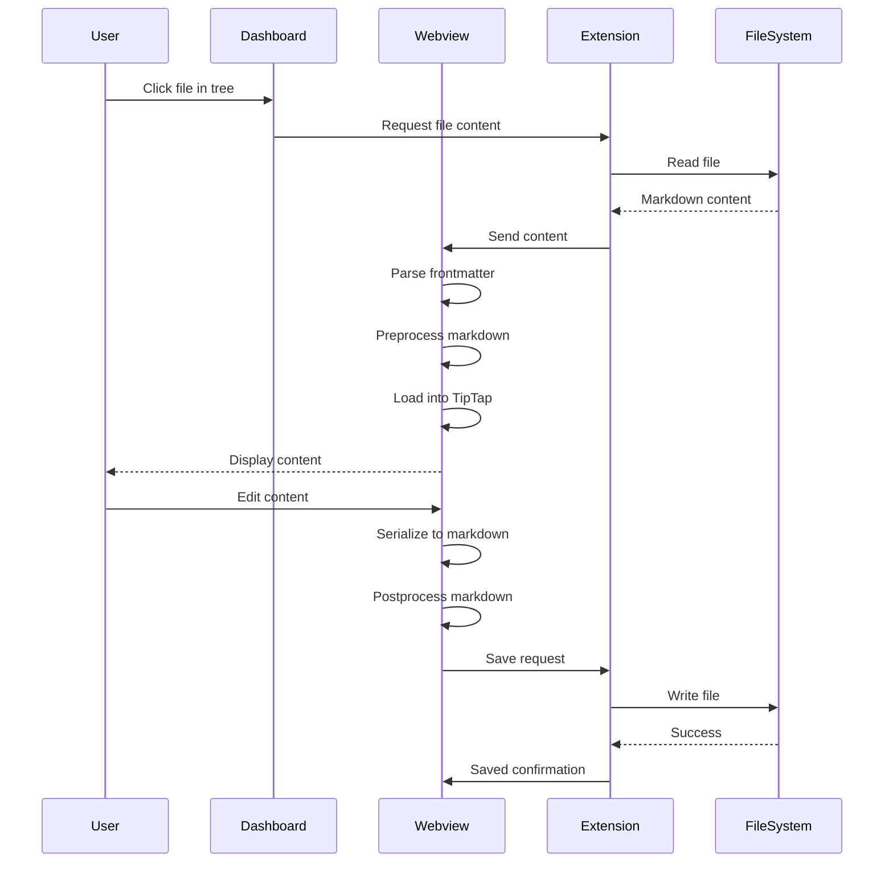

# Architecture Overview

**Version:** 1.6.4

SpecTacular is a specification-driven development toolkit consisting of two main components that work together to provide a complete spec management workflow.

## System Overview



## Component Relationship



## Architecture Components

### 1. CLI Tool (spectacular-cli)

The CLI is a .NET 8 command-line tool responsible for:

- **Project Scaffolding** - Creates folder structure, templates, and AI workflow commands
- **Template Management** - Embeds templates and applies variable substitution
- **Self-Updating** - Checks GitHub releases and updates itself
- **Configuration** - Manages global and project-level settings

**Technology Stack:**
- .NET 8
- System.CommandLine
- Single-file deployment
- Embedded resources

[Learn more →](./cli)

### 2. VS Code Extension (spectacular-vscode)

The extension provides rich markdown preview and editing:

- **Markdown Dashboard** - Preview specs with status tags and wikilinks
- **WYSIWYG Editor** - TipTap-based rich text editing
- **Specs Tree View** - Navigate specification files
- **Auto Task Status** - Automatically updates task status from acceptance criteria
- **Real-time Watching** - File system monitoring with debouncing

**Technology Stack:**
- TypeScript 5.3.2
- VS Code Extension API
- React 18 + Vite (webview)
- TipTap 3 (editor)
- Tailwind CSS

The extension consists of two sub-components:
- **Extension Host** - Node.js environment, VS Code API access
- **Webview** - Browser environment, React UI

[Learn more →](./extension)

### 3. Webview (React UI)

The webview is a standalone React application embedded in VS Code:

- **React Components** - Dashboard, editor, tree view
- **TipTap Editor** - ProseMirror-based WYSIWYG editing
- **Custom Extensions** - Status tags, wikilinks
- **Markdown Serialization** - Bidirectional markdown ↔ HTML conversion

[Learn more →](./webview)

## Data Flow

### Initialization Flow



### Editing Flow



[Learn more →](./data-flow)

## Technology Stack

### CLI Tool

| Layer | Technology | Version |
|-------|------------|---------|
| Runtime | .NET | 8.0 |
| CLI Framework | System.CommandLine | 2.0.0-beta4 |
| Build Tool | dotnet CLI | - |
| Deployment | Single-file exe | - |

### VS Code Extension

| Layer | Technology | Version |
|-------|------------|---------|
| Extension API | VS Code Extension API | ^1.85.0 |
| Language | TypeScript | 5.3.2 |
| Build Tool | esbuild | 0.19.8 |
| Package Tool | vsce | 2.22.0 |

### Webview (React)

| Layer | Technology | Version |
|-------|------------|---------|
| Framework | React | 18.2.0 |
| Build Tool | Vite | 5.0.7 |
| Editor | TipTap | 3.13.0 |
| Markdown | react-markdown | 9.0.1 |
| Styling | Tailwind CSS | 3.3.6 |
| Testing | Vitest | 1.0.4 |

## Key Design Decisions

### 1. Markdown-First Architecture

All specs are stored as plain markdown files with YAML frontmatter. Benefits:

- ✅ Version control friendly (Git)
- ✅ Editor agnostic (any text editor)
- ✅ AI assistant friendly (Claude Code, Cursor)
- ✅ No vendor lock-in
- ✅ Searchable with standard tools (grep, ripgrep)

### 2. File System as Database

No separate database; the file system is the source of truth:

- ✅ Simple backup (copy files)
- ✅ Portable (works anywhere)
- ✅ Real-time collaboration (sync tools)
- ⚠️ Scalability limits (thousands of files work fine)

### 3. Singleton Patterns

Key services use singleton pattern:

- `DashboardPanel` - One dashboard instance per workspace
- `VersionCheckService` - One update checker
- Benefits: Resource efficiency, state consistency

### 4. Message Passing Architecture

Extension ↔ Webview communicate via message passing:

- ✅ Clean separation of concerns
- ✅ Webview can be reloaded independently
- ✅ Type-safe message protocols
- ⚠️ Async communication requires careful handling

[Learn more →](./message-protocol)

### 5. Custom Markdown Syntax

Extends standard markdown with:

- **Status tags:** `#status/done` → Colored badges
- **Wikilinks:** `[[filename]]` → Clickable navigation

Implemented via:
- TipTap custom extensions (editor)
- Preprocessing/postprocessing (serialization)

### 6. Debounced File Watching

File changes trigger updates with 300ms debounce:

- ✅ Prevents excessive updates during rapid changes
- ✅ Handles external file modifications
- ✅ Respects VS Code's file watching limits

### 7. Frontmatter Preservation

YAML frontmatter is preserved across edits:

- Stored separately during editing
- Prepended on save
- Not part of TipTap content
- Ensures metadata integrity

## Development Patterns

### CLI Development

**Pattern:** Command Pattern with Service Layer

- Commands handle CLI parsing
- Services contain business logic
- Template-based code generation

**Example:**
```
InitCommand → ScaffoldService → TemplateService → FileSystem
```

### Extension Development

**Pattern:** Provider Pattern + Singleton

- Tree Data Provider for specs tree
- File Decoration Provider for status badges
- Singleton panels for dashboard

**Example:**
```
VS Code → SpecsTreeProvider → FileSystemWatcher → TreeView
```

### Webview Development

**Pattern:** Component-Based React

- Functional components
- Custom hooks for logic
- Context API for theming
- State lifting pattern

**Example:**
```
App → DashboardPanel → WysiwygEditor → TipTap
```

## Communication Protocols

### Extension → Webview

```typescript
{
  type: 'loadContent' | 'fileUpdated' | 'themeChanged',
  data: any
}
```

### Webview → Extension

```typescript
{
  command: 'saveFile' | 'openFile' | 'createFile',
  ...params
}
```

[Learn more →](./message-protocol)

## Project Structure

```
SpecTacular/
├── spectacular-cli/           # .NET 8 CLI tool
│   ├── Spectacular.Cli/       # Main project
│   │   ├── Commands/          # InitCommand, UpdateCommand
│   │   ├── Services/          # Business logic
│   │   └── Resources/templates/  # Embedded templates
│   └── Spectacular.Cli.Tests/ # Unit tests
├── spectacular-vscode/        # VS Code extension
│   ├── src/                   # Extension host (TypeScript)
│   │   ├── extension.ts       # Entry point
│   │   ├── DashboardPanel.ts  # Main webview panel
│   │   ├── SpecsTreeProvider.ts
│   │   └── TaskStatusService.ts
│   └── webview/               # React UI
│       ├── src/
│       │   ├── App.tsx        # Main component
│       │   ├── components/    # UI components
│       │   └── hooks/         # Custom hooks
│       └── package.json
├── .spectacular/              # Configuration & templates
├── specs/                     # Example specs
├── ARCHITECTURE.md            # This documentation
└── README.md                  # User documentation
```

## Next Steps

Dive deeper into each component:

- [CLI Architecture](./cli) - Command pattern, services, templates
- [Extension Architecture](./extension) - Extension host, providers, file watching
- [Webview Architecture](./webview) - React components, TipTap, custom extensions
- [Message Protocol](./message-protocol) - Communication between extension and webview
- [Data Flow](./data-flow) - End-to-end workflows and state management

## Glossary

| Term | Definition |
|------|------------|
| **Frontmatter** | YAML metadata at the top of markdown files |
| **Wikilink** | `[[link]]` syntax for internal document references |
| **Status Tag** | `#status/done` syntax for visual status indicators |
| **Spec** | Specification document (feature, requirement) |
| **Task** | Implementation task with acceptance criteria |
| **Plan** | Implementation plan breaking down a spec |
| **Dashboard** | Main webview panel for preview/editing |
| **Tree View** | VS Code sidebar showing spec files |
| **WYSIWYG** | What You See Is What You Get (visual editor) |
| **Debouncing** | Delaying action until after rapid events settle |

## Architecture Diagrams

This documentation includes **22 Mermaid diagrams** illustrating:

- System overviews
- Component architectures
- Sequence diagrams
- State machines
- Data flows
- File structures

All diagrams are rendered in the VitePress documentation.
