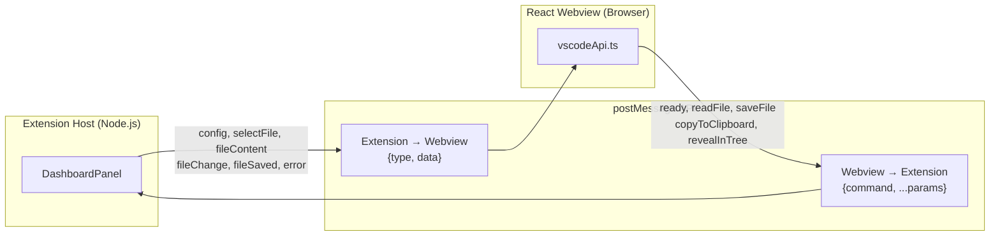
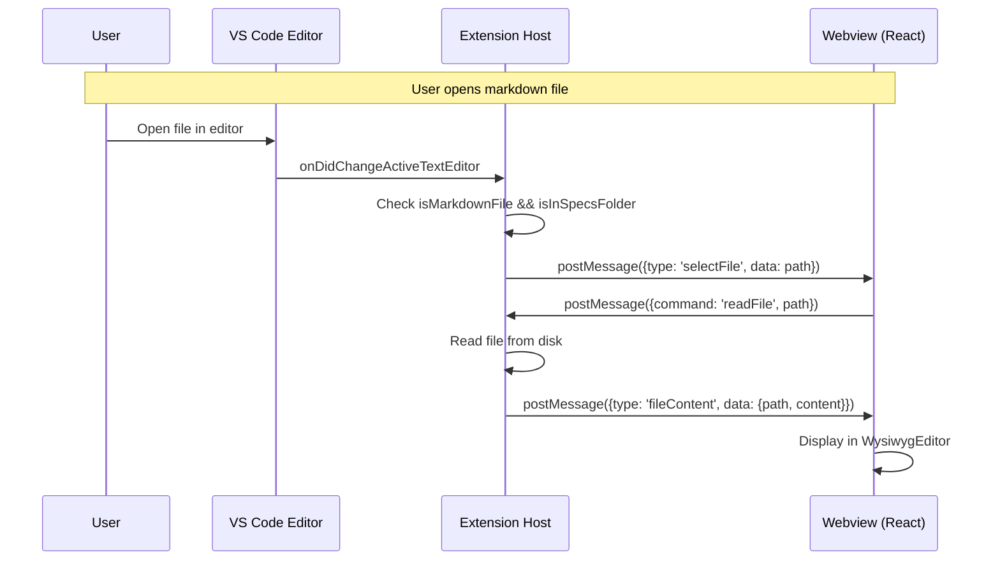
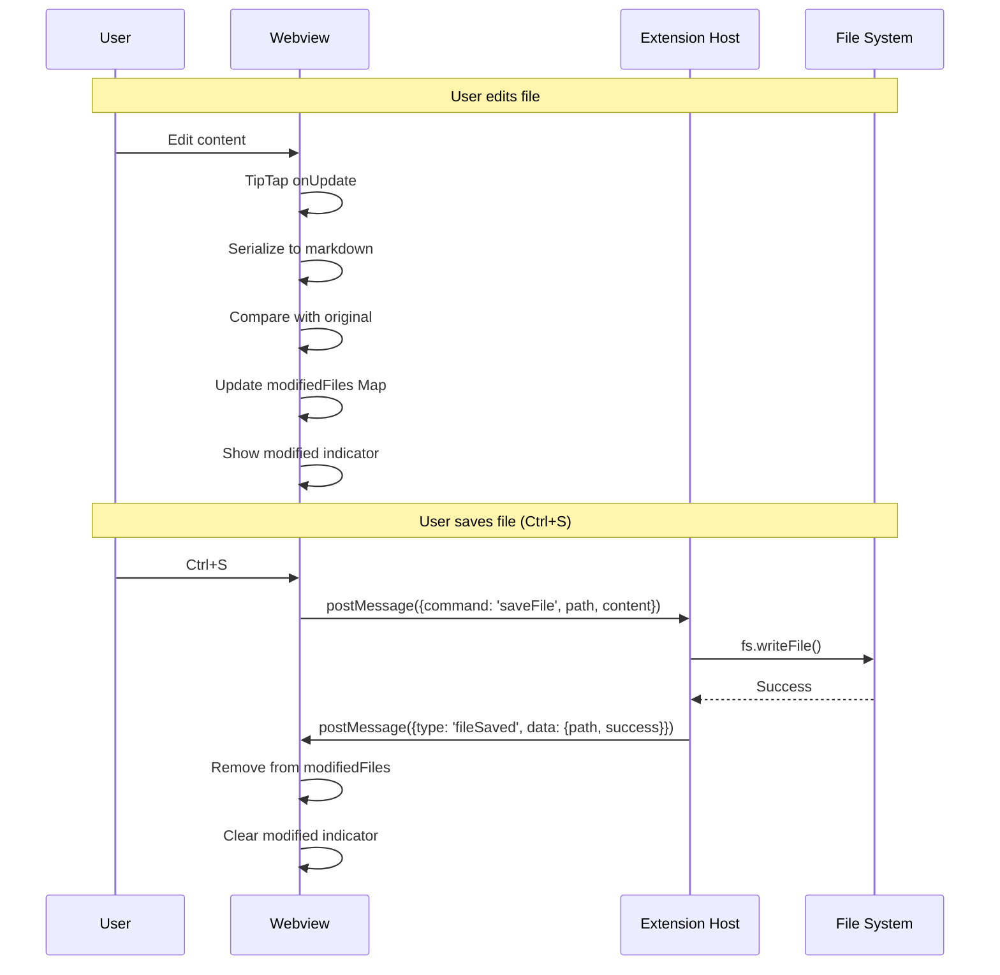
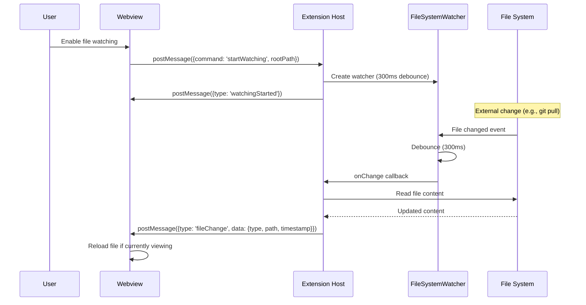

# Message Protocol

Communication between the VS Code Extension Host and the React Webview uses the `postMessage` API for bidirectional messaging.

## Architecture



## Message Types

### Extension → Webview

Messages sent from the extension host to the webview.

**Format:**
```typescript
{
  type: string;
  data: any;
}
```

**Message Types:**

| Type | Data | Trigger | Purpose |
|------|------|---------|---------|
| `config` | `{ rootPath, isWatching, theme, workspaceFolders, versionInfo }` | Ready, theme change | Initial configuration |
| `selectFile` | `filePath: string` | Active editor change | Request file display |
| `fileContent` | `{ path, content }` | readFile response | Provide file content |
| `fileChange` | `{ type, path, timestamp }` | File system watcher | Notify of disk change |
| `fileSaved` | `{ path, success }` | Save completed | Confirm save success |
| `allFilesSaved` | `{ results: [...] }` | Save all completed | Batch save results |
| `watchingStarted` | - | Watcher started | Confirm watching on |
| `watchingStopped` | - | Watcher stopped | Confirm watching off |
| `folderSelected` | `path: string` | Directory selected | New folder selected |
| `themeChange` | `'dark' \| 'light'` | VS Code theme changed | Update UI theme |
| `error` | `{ message }` | Error occurred | Display error message |

### Webview → Extension

Commands sent from the webview to the extension host.

**Format:**
```typescript
{
  command: string;
  ...params
}
```

**Commands:**

| Command | Data | Purpose | Response |
|---------|------|---------|----------|
| `ready` | - | Webview initialized | `config` message |
| `readFile` | `{ path }` | Request file content | `fileContent` message |
| `saveFile` | `{ path, content }` | Save single file | `fileSaved` message |
| `saveAllFiles` | `{ files: [...] }` | Save multiple files | `allFilesSaved` message |
| `startWatching` | `{ rootPath }` | Begin file watching | `watchingStarted` message |
| `stopWatching` | - | Stop file watching | `watchingStopped` message |
| `setWatching` | `{ enabled }` | Toggle watching | Status update |
| `selectDirectory` | - | Open folder picker | `folderSelected` message |
| `openExternal` | `{ url }` | Open URL in browser | - |
| `copyToClipboard` | `{ text }` | Copy text to clipboard | - |
| `revealInTree` | `{ path }` | Reveal file in tree view | - |

## Message Flow Diagrams

### File Loading Flow



### File Editing Flow



### File Watching Flow



## Implementation Details

### Extension Host (TypeScript)

**File:** `src/DashboardPanel.ts`

**Sending Messages:**
```typescript
this._panel.webview.postMessage({
  type: 'fileContent',
  data: {
    path: filePath,
    content: fileContent
  }
});
```

**Receiving Messages:**
```typescript
this._panel.webview.onDidReceiveMessage(
  async (message) => {
    switch (message.command) {
      case 'readFile':
        const content = await fs.readFile(message.path, 'utf8');
        this._panel.webview.postMessage({
          type: 'fileContent',
          data: { path: message.path, content }
        });
        break;

      case 'saveFile':
        await fs.writeFile(message.path, message.content, 'utf8');
        this._panel.webview.postMessage({
          type: 'fileSaved',
          data: { path: message.path, success: true }
        });
        break;
    }
  }
);
```

### Webview (React)

**File:** `webview/src/vscodeApi.ts`

**Initialize API:**
```typescript
const vscode = acquireVsCodeApi();
```

**Sending Commands:**
```typescript
vscode.postMessage({
  command: 'saveFile',
  path: filePath,
  content: fileContent
});
```

**Receiving Messages:**
```typescript
window.addEventListener('message', (event) => {
  const message = event.data;

  switch (message.type) {
    case 'fileContent':
      setFileContent(message.data.content);
      setCurrentFile(message.data.path);
      break;

    case 'fileSaved':
      if (message.data.success) {
        // Remove from modified files
        setModifiedFiles(prev => {
          const next = new Map(prev);
          next.delete(message.data.path);
          return next;
        });
      }
      break;
  }
});
```

## State Synchronization

### Modified Files Tracking

**Webview State:**
```typescript
const [modifiedFiles, setModifiedFiles] = useState<Map<string, string>>(new Map());
```

**On Edit:**
```typescript
// When user edits content
const currentContent = editor.getHTML();
const originalContent = fileContent;

if (currentContent !== originalContent) {
  setModifiedFiles(prev => new Map(prev).set(currentFile, currentContent));
} else {
  setModifiedFiles(prev => {
    const next = new Map(prev);
    next.delete(currentFile);
    return next;
  });
}
```

**On Save:**
```typescript
vscode.postMessage({
  command: 'saveFile',
  path: currentFile,
  content: modifiedFiles.get(currentFile)
});
```

### File Watcher State

**Extension State:**
```typescript
private _isWatching: boolean = false;
private _watcher: vscode.FileSystemWatcher | undefined;
```

**Start Watching:**
```typescript
private _startWatching(rootPath: string) {
  if (this._watcher) {
    this._watcher.dispose();
  }

  this._watcher = vscode.workspace.createFileSystemWatcher(
    new vscode.RelativePattern(rootPath, '**/*.md')
  );

  // Debounce file changes (300ms)
  let debounceTimer: NodeJS.Timeout;

  this._watcher.onDidChange((uri) => {
    clearTimeout(debounceTimer);
    debounceTimer = setTimeout(() => {
      this._notifyFileChange('change', uri.fsPath);
    }, 300);
  });

  this._isWatching = true;
  this._panel.webview.postMessage({ type: 'watchingStarted' });
}
```

## Error Handling

### Extension Error Handling

```typescript
try {
  const content = await fs.readFile(filePath, 'utf8');
  this._panel.webview.postMessage({
    type: 'fileContent',
    data: { path: filePath, content }
  });
} catch (error) {
  this._panel.webview.postMessage({
    type: 'error',
    data: { message: `Failed to read file: ${error.message}` }
  });
}
```

### Webview Error Handling

```typescript
window.addEventListener('message', (event) => {
  const message = event.data;

  if (message.type === 'error') {
    vscode.window.showErrorMessage(message.data.message);
    // Update UI to show error state
    setError(message.data.message);
  }
});
```

## Debouncing Strategy

### File Watcher Debouncing

**Problem:** Rapid file changes (e.g., during `git pull`) trigger excessive updates.

**Solution:** 300ms debounce delay

```typescript
let debounceTimer: NodeJS.Timeout;

watcher.onDidChange((uri) => {
  clearTimeout(debounceTimer);
  debounceTimer = setTimeout(() => {
    this._notifyFileChange('change', uri.fsPath);
  }, 300);
});
```

**Benefits:**
- Reduces message frequency during batch changes
- Improves performance
- Prevents UI flicker

### Save Debouncing

**Problem:** User typing should not trigger saves.

**Solution:** Manual save only (Ctrl+S)

No auto-save to prevent:
- Accidental overwrites
- Performance issues
- File watcher loops

## Security Considerations

### Content Security Policy

Webview has strict CSP:

```typescript
<meta http-equiv="Content-Security-Policy"
      content="default-src 'none';
               script-src ${webview.cspSource};
               style-src ${webview.cspSource} 'unsafe-inline';
               img-src ${webview.cspSource} https:;">
```

### Path Validation

**Extension validates all file paths:**

```typescript
private _validatePath(filePath: string): boolean {
  const workspaceFolder = vscode.workspace.workspaceFolders?.[0];
  if (!workspaceFolder) return false;

  const normalized = path.normalize(filePath);
  return normalized.startsWith(workspaceFolder.uri.fsPath);
}
```

**Prevents:**
- Directory traversal attacks
- Access to files outside workspace
- Path injection

## Performance Optimization

### Message Batching

**Problem:** Saving multiple files sends multiple messages.

**Solution:** Batch save command

```typescript
// Webview sends batch
vscode.postMessage({
  command: 'saveAllFiles',
  files: Array.from(modifiedFiles.entries()).map(([path, content]) => ({
    path,
    content
  }))
});

// Extension processes batch
const results = await Promise.all(
  message.files.map(async (file) => {
    try {
      await fs.writeFile(file.path, file.content, 'utf8');
      return { path: file.path, success: true };
    } catch (error) {
      return { path: file.path, success: false, error: error.message };
    }
  })
);

this._panel.webview.postMessage({
  type: 'allFilesSaved',
  data: { results }
});
```

### State Persistence

**Webview state is persisted across reloads:**

```typescript
const vscode = acquireVsCodeApi();
const state = vscode.getState() || {};

// Save state
vscode.setState({
  currentFile,
  modifiedFiles: Array.from(modifiedFiles.entries())
});
```

## Next Steps

- [Extension Architecture](./extension) - Extension host details
- [Webview Architecture](./webview) - React UI architecture
- [Data Flow](./data-flow) - Complete workflows
- [CLI Architecture](./cli) - CLI tool architecture
