# CLI Commands

Complete reference for all SpecTacular CLI commands and options.

## init

Initialize SpecTacular in a directory, creating the complete spec-driven project structure.

### Synopsis

```bash
spectacular init [options]
```

### Options

| Option | Short | Description | Default |
|--------|-------|-------------|---------|
| `--name <name>` | `-n` | Project name | Directory name |
| `--tech <stack>` | `-t` | Technology stack (comma-separated) | None |
| `--path <directory>` | `-p` | Target directory | Current directory |
| `--language <lang>` | `-l` | Language (en, sk) | `en` |
| `--tool <tool>` | | AI tool (claude, cursor, both) | `both` |
| `--force` | `-f` | Overwrite existing files | `false` |

### Examples

**Basic initialization:**
```bash
spectacular init
```

**With project name and tech stack:**
```bash
spectacular init --name "MyApp" --tech "Node.js, TypeScript, React"
```

**In a different directory:**
```bash
spectacular init --path ~/projects/new-app --name "NewApp"
```

**Force overwrite:**
```bash
spectacular init --force
```

**Specify language:**
```bash
spectacular init --language sk
```

**Generate for Claude Code only:**
```bash
spectacular init --tool claude
```

### What Gets Created

```
project-directory/
├── .spectacular/
│   ├── config/
│   │   └── project.json              # Project configuration
│   ├── templates/
│   │   ├── spec-template.md          # Specification template
│   │   ├── spec-foam-template.md     # Alternative spec format
│   │   ├── plan-template.md          # Planning template
│   │   ├── task-template.md          # Task template
│   │   ├── task-foam-template.md     # Alternative task format
│   │   ├── tasks-template.md         # Task checklist
│   │   └── feature-template.md       # Feature template
│   ├── prompts/
│   │   ├── 0-quick.md                # Full pipeline prompt
│   │   ├── 1-spec.md                 # Specification prompt
│   │   ├── 2-plan.md                 # Planning prompt
│   │   ├── 3-tasks.md                # Task breakdown prompt
│   │   ├── 4-implement.md            # Implementation prompt
│   │   └── 5-validate.md             # Validation prompt
│   ├── scripts/
│   │   └── powershell/
│   │       └── generate-commands.ps1 # Command generator
│   ├── memory/
│   │   └── constitution.md           # Project guidelines
│   └── examples/
│       └── 000-example-healthcheck/  # Example feature
├── .claude/
│   ├── commands/
│   │   ├── spectacular.0-quick.md    # Quick pipeline command
│   │   ├── spectacular.1-spec.md     # Spec command
│   │   ├── spectacular.2-plan.md     # Plan command
│   │   ├── spectacular.3-tasks.md    # Tasks command
│   │   ├── spectacular.4-implement.md # Implement command
│   │   └── spectacular.5-validate.md # Validate command
│   └── tasks/
│       ├── backlog.md                # Task backlog
│       ├── decisions.md              # Decision log
│       └── index.md                  # Tasks index
├── .cursor/
│   └── rules/
│       ├── spectacular.0-quick.md    # Quick pipeline rule
│       ├── spectacular.1-spec.md     # Spec rule
│       ├── spectacular.2-plan.md     # Plan rule
│       ├── spectacular.3-tasks.md    # Tasks rule
│       ├── spectacular.4-implement.md # Implement rule
│       └── spectacular.5-validate.md # Validate rule
├── specs/
│   └── .gitkeep                      # Keep directory in git
└── CLAUDE.md                          # Project instructions for AI
```

### Variable Substitution

Templates support these variables:

| Variable | Description | Example |
|----------|-------------|---------|
| `{{PROJECT_NAME}}` | Project name from --name | "MyApp" |
| `{{TECH_STACK}}` | Tech stack from --tech | "Node.js, TypeScript" |
| `{{TECH_STACK_LIST}}` | Tech stack as markdown list | "- Node.js\n- TypeScript" |
| `{{DATE}}` | Current date | "2024-12-22" |
| `{{LANGUAGE}}` | Language from --language | "en" |

Example template usage:
```markdown
---
project: {{PROJECT_NAME}}
created: {{DATE}}
---

# {{PROJECT_NAME}} Specification

## Tech Stack
{{TECH_STACK_LIST}}
```

Becomes:
```markdown
---
project: MyApp
created: 2024-12-22
---

# MyApp Specification

## Tech Stack
- Node.js
- TypeScript
```

### project.json

The generated `project.json` contains:

```json
{
  "projectName": "MyApp",
  "techStack": ["Node.js", "TypeScript", "React"],
  "language": "en",
  "tool": "both",
  "version": "1.6.4",
  "initialized": "2024-12-22T10:30:00Z"
}
```

---

## update

Update SpecTacular CLI to the latest version.

### Synopsis

```bash
spectacular update [options]
```

### Options

| Option | Short | Description |
|--------|-------|-------------|
| `--check` | `-c` | Only check for updates (don't install) |

### Examples

**Check for updates:**
```bash
spectacular update --check
```

Output:
```
Current version: 1.6.4
Latest version:  1.7.0
Update available!
```

**Update to latest:**
```bash
spectacular update
```

Output:
```
Downloading version 1.7.0...
Installing...
Update complete! 🎉
Spectacular is now at version 1.7.0
```

### How It Works

1. **Check GitHub Releases** - Queries the GitHub API for latest release
2. **Compare Versions** - Uses semantic versioning comparison
3. **Download** - Downloads the new executable
4. **Replace** - Replaces the current executable
5. **Update PATH** - Updates PATH if needed
6. **Verify** - Confirms the new version

### Update Process

```mermaid
sequenceDiagram
    participant User
    participant CLI
    participant GitHub
    participant FileSystem

    User->>CLI: spectacular update
    CLI->>GitHub: Check latest release
    GitHub-->>CLI: v1.7.0
    CLI->>CLI: Compare with current (v1.6.4)
    CLI->>User: Update available!
    CLI->>GitHub: Download executable
    GitHub-->>CLI: spectacular.exe
    CLI->>FileSystem: Replace old version
    CLI->>FileSystem: Update PATH
    CLI->>User: Update complete! ✓
```



### Automatic Update Checks

The CLI checks for updates:
- Every 24 hours (configurable)
- When running `spectacular init`
- Can be disabled in global config

Configure in `~/.spectacular/config/global.json`:
```json
{
  "checkForUpdates": true,
  "updateCheckInterval": 86400
}
```

### Troubleshooting

**Update download fails:**
```bash
# Check internet connection
ping github.com

# Set proxy if needed
$env:HTTP_PROXY = "http://proxy:8080"
spectacular update
```

**Permission denied:**
```powershell
# Close all terminals using spectacular
# Then run update
spectacular update
```

---

## --version

Display version information.

### Synopsis

```bash
spectacular --version
```

### Output

```
SpecTacular CLI v1.6.4
.NET 8.0
Copyright © 2024 SpecTacular Contributors
```

### Usage

```bash
spectacular --version
# or
spectacular -v
```

---

## --help

Display help information.

### Synopsis

```bash
spectacular --help
spectacular <command> --help
```

### General Help

```bash
spectacular --help
```

Output:
```
SpecTacular CLI v1.6.4

Description:
  Specification-driven development toolkit

Usage:
  spectacular [command] [options]

Commands:
  init      Initialize SpecTacular in a directory
  update    Update to the latest version

Options:
  --version    Show version information
  --help       Show help and usage information
```

### Command-Specific Help

```bash
spectacular init --help
```

Output:
```
Description:
  Initialize SpecTacular in a directory

Usage:
  spectacular init [options]

Options:
  -n, --name <name>       Project name
  -t, --tech <stack>      Technology stack (comma-separated)
  -p, --path <directory>  Target directory
  -l, --language <lang>   Language (en, sk)
  --tool <tool>           AI tool (claude, cursor, both)
  -f, --force             Overwrite existing files
  --help                  Show help
```

---

## Exit Codes

| Code | Meaning |
|------|---------|
| 0 | Success |
| 1 | General error |
| 2 | Invalid arguments |
| 3 | File system error |
| 4 | Network error (update) |
| 5 | Already initialized (without --force) |

### Examples

```powershell
# Check if command succeeded
spectacular init --name "Test"
if ($LASTEXITCODE -eq 0) {
    Write-Host "Success!"
}

# Handle errors
spectacular init
if ($LASTEXITCODE -eq 5) {
    Write-Host "Already initialized. Use --force to overwrite."
}
```

---

## Environment Variables

| Variable | Description | Example |
|----------|-------------|---------|
| `SPECTACULAR_HOME` | Override default home directory | `C:\Tools\SpecTacular` |
| `SPECTACULAR_UPDATE_CHECK` | Disable update checks | `false` |
| `HTTP_PROXY` | Proxy server for downloads | `http://proxy:8080` |
| `HTTPS_PROXY` | HTTPS proxy server | `https://proxy:8080` |

### Usage

```powershell
# Disable update checks
$env:SPECTACULAR_UPDATE_CHECK = "false"
spectacular init

# Use custom home directory
$env:SPECTACULAR_HOME = "C:\Tools\SpecTacular"
spectacular init
```

---

## Next Steps

- [Templates](./templates) - Customize templates and prompts
- [Configuration](/getting-started/configuration) - Configure global and project settings
- [CLI Architecture](/architecture/cli) - Learn how the CLI works internally
- [Development](/development/building) - Build and modify the CLI
