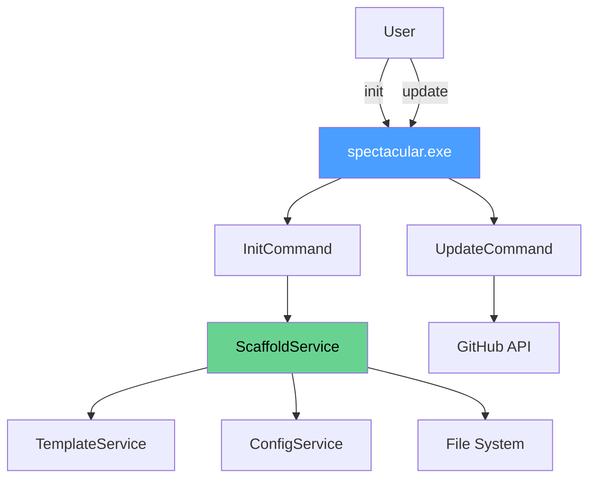

# CLI Overview

The SpecTacular CLI (`spectacular`) is a .NET 8 command-line tool that scaffolds specification-driven projects with templates, AI workflow commands, and configuration.

## Features

### 🚀 Project Initialization

Creates a complete spec-driven project structure in seconds:

```bash
spectacular init --name "MyProject" --tech "Node.js, TypeScript"
```

Generated structure:
```
your-project/
├── .spectacular/         # Templates, scripts, configuration
│   ├── templates/        # Spec, plan, task templates
│   ├── prompts/          # AI workflow prompts
│   ├── scripts/          # PowerShell automation
│   └── memory/           # Project constitution
├── .claude/commands/     # Claude Code slash commands
├── .cursor/rules/        # Cursor AI rules
├── specs/                # Feature specifications directory
└── CLAUDE.md             # AI assistant instructions
```

### 🔄 Self-Updating

Built-in update checker and installer:

```bash
spectacular update --check    # Check for updates
spectacular update            # Update to latest version
```

The CLI:
- Checks GitHub releases for new versions
- Downloads updates automatically
- Updates PATH configuration
- No manual reinstallation needed

### 🛠️ Multi-Tool Support

Generates commands for both **Claude Code** and **Cursor**:

- **Claude Code:** Slash commands in `.claude/commands/`
- **Cursor:** AI rules in `.cursor/rules/`

Both use the same source prompts from `.spectacular/prompts/`.

### 📝 Template-Based Scaffolding

Uses embedded templates for consistency:
- Spec templates
- Plan templates
- Task templates
- Foam-style templates (alternative format)

All templates support variable substitution: `{{PROJECT_NAME}}`, `{{TECH_STACK}}`, `{{DATE}}`

## Installation

See the [Installation Guide](/getting-started/#step-1-install-cli) for detailed instructions.

**Quick install:**
```powershell
irm https://raw.githubusercontent.com/Tadzesi/SpecTacular/master/spectacular-cli/installer/install.ps1 | iex
```

## Commands

| Command | Description |
|---------|-------------|
| `spectacular init` | Initialize SpecTacular in current directory |
| `spectacular update` | Update to latest version |
| `spectacular --version` | Show version information |
| `spectacular --help` | Show help information |

See [Commands Reference](./commands) for detailed documentation.

## Architecture

The CLI is built with:
- **.NET 8** - Modern, cross-platform runtime
- **System.CommandLine** - Powerful command parsing
- **Embedded Resources** - Templates compiled into executable
- **Single-file deployment** - No dependencies to install



Key components:
- **Commands/** - CLI command implementations (`InitCommand`, `UpdateCommand`)
- **Services/** - Business logic (scaffolding, templates, config)
- **Resources/templates/** - Embedded template files

## Use Cases

### Initialize a New Project

```bash
cd my-new-project
spectacular init --name "MyApp" --tech "Python, FastAPI, PostgreSQL"
```

### Add SpecTacular to Existing Project

```bash
cd existing-project
spectacular init --force
```

The `--force` flag overwrites existing files (use with caution!).

### Initialize in Different Directory

```bash
spectacular init --path ../other-project --name "OtherApp"
```

### Specify Language

```bash
spectacular init --language sk  # Slovak
spectacular init --language en  # English (default)
```

## Configuration

The CLI stores configuration in:
- **Global:** `~/.spectacular/config/global.json`
- **Project:** `.spectacular/config/project.json`

See [Configuration Guide](/getting-started/configuration) for details.

## Templates

### Embedded Templates

Templates are embedded in the CLI executable:
- `.claude/commands/spectacular.*.md`
- `.spectacular/templates/*.md`
- `.spectacular/prompts/*.md`
- `CLAUDE.md`

### Custom Templates

After initialization, customize templates in `.spectacular/templates/`:

```bash
cd .spectacular/templates
code spec-template.md  # Edit spec template
```

Then regenerate commands:

```powershell
cd .spectacular/scripts/powershell
.\generate-commands.ps1
```

## Development

### Build from Source

```powershell
git clone https://github.com/Tadzesi/SpecTacular.git
cd SpecTacular/spectacular-cli/Spectacular.Cli
dotnet publish -c Release -r win-x64 -o ../publish/win-x64
```

### Local Installation

```powershell
cd ../installer
.\install.ps1 -Local
```

### Run Tests

```powershell
cd ..
dotnet test
```

See [Development Guide](/development/building) for more details.

## Troubleshooting

### Command not found

**Symptom:** `spectacular : The term 'spectacular' is not recognized`

**Solution:** Restart your terminal or reload PATH:
```powershell
$env:Path = [System.Environment]::GetEnvironmentVariable("Path","User")
```

### Permission denied

**Symptom:** Installation fails with permission errors

**Solution:** The installer doesn't require admin rights. Check antivirus settings.

### Update fails

**Symptom:** `spectacular update` fails to download

**Solution:** Check internet connection and proxy settings:
```powershell
# Set proxy if needed
$env:HTTP_PROXY = "http://proxy.example.com:8080"
spectacular update
```

### .NET Runtime not found

**Symptom:** Error about missing .NET runtime

**Solution:** Download .NET 8 runtime from [https://dot.net](https://dot.net)

## Uninstall

To remove SpecTacular:

```powershell
~/.spectacular/bin/uninstall.ps1
```

This removes:
- CLI executable
- Global configuration
- PATH entries

Project files (`.spectacular/`, `specs/`) are not removed.

## Next Steps

- [Commands Reference](./commands) - Detailed command documentation
- [Templates](./templates) - Template customization guide
- [Development](/development/building) - Build and contribute to CLI
- [Architecture](/architecture/cli) - Deep dive into CLI architecture
