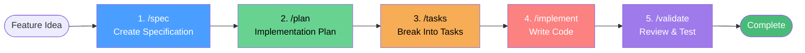

# Specification Pipeline

The SpecTacular specification pipeline is an AI-assisted workflow for turning feature ideas into implemented code.

## Overview

The pipeline consists of 5 stages, each with a corresponding Claude Code command:



## Prerequisites

Ensure you've initialized SpecTacular in your project:

```bash
cd your-project
spectacular init --name "MyProject"
```

This creates the `.claude/commands/` directory with all pipeline commands.

## Pipeline Stages

### Stage 1: Specification (/spec)

**Purpose:** Create a detailed specification document

**Command:**
```
/spec "Add user authentication with JWT tokens"
```

**What It Does:**
1. Analyzes your feature request
2. Researches your codebase for context
3. Creates a spec file in `specs/###-feature-name/`
4. Includes:
   - Overview and business value
   - Functional and non-functional requirements
   - Architecture design
   - Success criteria
   - Dependencies

**Output:** `specs/001-user-authentication/authentication-spec.md`

**Example Spec:**
```markdown
---
type: spec
status: pending
created: 2024-12-22
---

# User Authentication Specification

## Overview
Implement JWT-based authentication for secure user access.

## Requirements

### Functional Requirements
- Users can register with email and password
- Users can log in and receive JWT token
- Token expires after 24 hours
- Password reset via email

### Non-Functional Requirements
- Authentication response time < 500ms
- Passwords hashed with bcrypt (salt rounds: 10)
- HTTPS required for all auth endpoints

## Architecture

### Components
1. **AuthController** - API endpoints
2. **AuthService** - Business logic
3. **TokenService** - JWT generation/validation
4. **UserRepository** - Database access

### Data Model
```sql
CREATE TABLE users (
  id UUID PRIMARY KEY,
  email VARCHAR(255) UNIQUE NOT NULL,
  password_hash VARCHAR(255) NOT NULL,
  created_at TIMESTAMP DEFAULT NOW()
);
```

## Success Criteria
- [ ] User can register successfully
- [ ] User can log in and receive valid token
- [ ] Invalid credentials are rejected
- [ ] Token expires correctly
- [ ] All security tests pass

## Dependencies
- Database: [[database-setup]]
- Email service: [[email-service]]
```

### Stage 2: Plan (/plan)

**Purpose:** Create an implementation plan

**Command:**
```
/plan
```

**What It Does:**
1. Reads the current specification
2. Breaks down implementation into phases
3. Identifies risks and dependencies
4. Creates timeline estimates

**Output:** `specs/001-user-authentication/authentication-plan.md`

**Example Plan:**
```markdown
---
type: plan
status: pending
spec: [[authentication-spec]]
---

# User Authentication - Implementation Plan

## Goal
Implement secure JWT-based authentication system.

## Approach

### Phase 1: Database Setup
**Objective:** Create user storage

**Steps:**
1. Create migration for users table
2. Add indexes on email column
3. Set up database connection pool

**Deliverables:**
- Migration file: `migrations/001_create_users.sql`
- User model: `models/User.ts`

### Phase 2: Core Authentication
**Objective:** Implement auth logic

**Steps:**
1. Create AuthService with registration logic
2. Implement password hashing (bcrypt)
3. Add login logic with JWT generation
4. Create middleware for token validation

**Deliverables:**
- `services/AuthService.ts`
- `services/TokenService.ts`
- `middleware/authenticate.ts`

### Phase 3: API Endpoints
**Objective:** Expose REST API

**Steps:**
1. Create POST /auth/register endpoint
2. Create POST /auth/login endpoint
3. Add error handling and validation
4. Write API documentation

**Deliverables:**
- `controllers/AuthController.ts`
- API docs in OpenAPI format

### Phase 4: Testing & Validation
**Objective:** Ensure security and reliability

**Steps:**
1. Write unit tests for services
2. Write integration tests for endpoints
3. Security testing (SQL injection, XSS)
4. Load testing for performance

**Deliverables:**
- Test suite with >80% coverage
- Performance benchmarks

## Risk Analysis

| Risk | Impact | Mitigation |
|------|--------|------------|
| Password storage breach | High | Use bcrypt, never store plaintext |
| Token theft | High | HTTPS only, short expiry |
| Brute force attacks | Medium | Rate limiting on login |

## Timeline

| Phase | Duration | Dependencies |
|-------|----------|--------------|
| Phase 1 | 2 days | Database access |
| Phase 2 | 3 days | Phase 1 |
| Phase 3 | 2 days | Phase 2 |
| Phase 4 | 2 days | Phase 3 |

**Total:** 9 days
```

### Stage 3: Tasks (/tasks)

**Purpose:** Break plan into actionable tasks

**Command:**
```
/tasks
```

**What It Does:**
1. Reads the implementation plan
2. Creates individual task files
3. Generates `tasks.md` checklist
4. Each task has acceptance criteria

**Output:**
- `specs/001-user-authentication/tasks.md` (overview)
- `specs/001-user-authentication/task-01.md`
- `specs/001-user-authentication/task-02.md`
- ... etc.

**Example Tasks Overview:**
```markdown
---
type: tasks
status: pending
spec: [[authentication-spec]]
plan: [[authentication-plan]]
---

# User Authentication - Tasks

## Task Summary

| # | Task | Status | Assignee |
|---|------|--------|----------|
| 1 | [[task-01]] Create users database table | #status/pending | |
| 2 | [[task-02]] Implement password hashing | #status/pending | |
| 3 | [[task-03]] Create JWT token service | #status/pending | |
| 4 | [[task-04]] Build registration endpoint | #status/pending | |
| 5 | [[task-05]] Build login endpoint | #status/pending | |
| 6 | [[task-06]] Add authentication middleware | #status/pending | |
| 7 | [[task-07]] Write unit tests | #status/pending | |
| 8 | [[task-08]] Security testing | #status/pending | |

## Progress
- Total Tasks: 8
- Completed: 0
- In Progress: 0
- Blocked: 0
```

**Example Individual Task:**
```markdown
---
type: task
status: pending
spec: [[authentication-spec]]
priority: high
---

# Task 01: Create Users Database Table

## Description
Create database migration and model for user storage.

## Acceptance Criteria
- [ ] Migration file created in `migrations/001_create_users.sql`
- [ ] Users table has id, email, password_hash, created_at columns
- [ ] Email column has unique constraint
- [ ] User model created in `models/User.ts`
- [ ] Migration successfully runs on test database

## Implementation Notes
- Use UUID for id (more secure than auto-increment)
- Index on email for fast lookups
- Use TIMESTAMP for created_at

## Dependencies
- Requires: Database connection configured
- Blocks: [[task-02]], [[task-04]]

## Estimated Effort
4 hours
```

### Stage 4: Implement (/implement)

**Purpose:** Write the actual code

**Command:**
```
/implement
```

**What It Does:**
1. Reads specs, plan, and current task
2. Analyzes codebase for context
3. Writes implementation code
4. Follows project patterns
5. Updates task status

**Usage:**

```
# Start with first task
/implement task-01

# After completing, move to next
/implement task-02
```

**What Claude Does:**
1. Reads task acceptance criteria
2. Searches codebase for similar patterns
3. Writes code following conventions
4. Checks all acceptance criteria
5. Marks criteria as complete
6. Updates task status to `done`

### Stage 5: Validate (/validate)

**Purpose:** Review and test implementation

**Command:**
```
/validate
```

**What It Does:**
1. Reviews all completed tasks
2. Checks code quality
3. Runs tests
4. Validates success criteria from spec
5. Identifies issues

**Output:** Validation report

**Example:**
```markdown
# Validation Report: User Authentication

## ✅ Completed Tasks
- [x] Task 01: Create users database table
- [x] Task 02: Implement password hashing
- [x] Task 03: Create JWT token service
- [x] Task 04: Build registration endpoint
- [x] Task 05: Build login endpoint
- [x] Task 06: Add authentication middleware
- [x] Task 07: Write unit tests
- [x] Task 08: Security testing

## ✅ Success Criteria
- [x] User can register successfully
- [x] User can log in and receive valid token
- [x] Invalid credentials are rejected
- [x] Token expires correctly
- [x] All security tests pass

## Code Quality
- Test Coverage: 87%
- Linting: 0 errors, 2 warnings
- Security Scan: No vulnerabilities

## Issues Found
None

## Recommendation
✅ Ready for production deployment
```

## Quick Pipeline (Alternative)

For smaller features, use the quick command:

```
/0-quick "Add password reset functionality"
```

This runs the entire pipeline automatically:
1. Creates spec
2. Creates plan
3. Breaks into tasks
4. Prompts you to implement each task
5. Validates when done

## Best Practices

### 1. Clear Feature Descriptions

❌ Bad: "Add auth"
✅ Good: "Add JWT-based authentication with email/password registration and login"

### 2. Review Before Implementation

Always review the spec and plan before starting implementation:
- Are requirements complete?
- Are dependencies identified?
- Are risks addressed?

### 3. Update Status Tags

Keep status tags current:
- Spec: `#status/pending` → `#status/in-progress` → `#status/done`
- Tasks: Auto-updated when criteria are checked

### 4. Link Documents

Use wikilinks extensively:
```markdown
Depends on: [[database-setup]]
Related: [[user-profile]], [[permissions]]
```

### 5. Iterative Refinement

Don't expect perfection first try:
- Spec → Review → Refine
- Plan → Estimate → Adjust
- Implement → Test → Fix

## Workflow Examples

### Example 1: New Feature

```bash
# 1. Create spec
/spec "Add file upload to user profile"

# 2. Review spec in dashboard
# Make any edits needed

# 3. Create plan
/plan

# 4. Review plan, adjust timeline

# 5. Break into tasks
/tasks

# 6. Implement tasks one by one
/implement task-01
/implement task-02
# ... etc.

# 7. Validate
/validate
```

### Example 2: Bug Fix

```bash
# 1. Create spec for fix
/spec "Fix: User logout doesn't invalidate token"

# 2. Create quick plan
/plan

# 3. Single task for simple fix
/tasks

# 4. Implement
/implement task-01

# 5. Validate fix
/validate
```

### Example 3: Refactoring

```bash
# 1. Document refactoring
/spec "Refactor: Extract auth logic into separate service"

# 2. Plan migration strategy
/plan

# 3. Break into safe incremental tasks
/tasks

# 4. Implement step by step
/implement task-01  # Extract without breaking
/implement task-02  # Update tests
/implement task-03  # Remove old code

# 5. Validate no regressions
/validate
```

## Tips

💡 **Start small** - Use pipeline for one small feature first to learn

💡 **Customize templates** - Edit `.spectacular/templates/` to match your needs

💡 **Use the dashboard** - WYSIWYG editor makes editing specs easier

💡 **Link everything** - Wikilinks create a knowledge graph

💡 **Trust auto-status** - Let the system track completion for you

💡 **Review generated code** - AI assists, but you're in control

## Next Steps

- [Task Management](./task-management) - Advanced task workflows
- [Status Tags](./status-tags) - Master status tag conventions
- [CLI Commands](/guide/cli/commands) - CLI command reference
- [Extension Features](/guide/extension/features) - Dashboard capabilities
