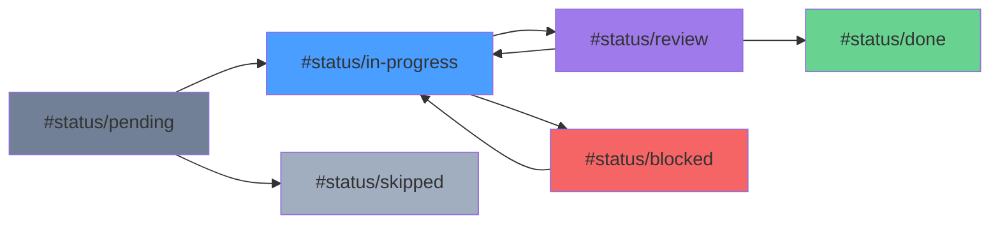
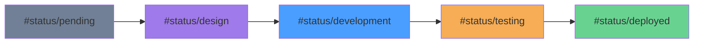

# Status Tags

Complete guide to using status tags in SpecTacular for visual task and feature tracking.

## Overview

Status tags are markdown syntax that renders as colored badges in the dashboard:

```markdown
#status/done      → 🟢 Done
#status/pending   → ⚪ Pending
```

## Standard Status Tags

### Complete Set

| Tag | Rendered | Color | Use For |
|-----|----------|-------|---------|
| `#status/done` | 🟢 Done | Green | Completed tasks/features |
| `#status/complete` | 🟢 Complete | Green | Finished (alternative) |
| `#status/pending` | ⚪ Pending | Gray | Not started |
| `#status/in-progress` | 🔵 In Progress | Blue | Currently working |
| `#status/blocked` | 🔴 Blocked | Red | Cannot proceed |
| `#status/skipped` | ⏭️ Skipped | Gray | Intentionally skipped |
| `#status/review` | 🟣 Review | Purple | Needs review |
| `#status/approved` | 🟢 Approved | Green | Reviewed and approved |

### Usage Examples

**In Frontmatter:**
```markdown
---
status: done
---
```

**In Content:**
```markdown
Current status: #status/in-progress

After completion, update to #status/done
```

**In Tables:**
```markdown
| Task | Status |
|------|--------|
| Setup | #status/done |
| Implement | #status/in-progress |
| Test | #status/pending |
```

## Status Lifecycle

### Task Lifecycle



### Feature Lifecycle



## Custom Status Tags

### Define Custom Tags

In project configuration:

```json
{
  "spectacular.statusTags.custom": {
    "wip": {
      "label": "Work in Progress",
      "color": "#f6ad55",
      "icon": "tools"
    },
    "archived": {
      "label": "Archived",
      "color": "#a0aec0",
      "icon": "archive"
    },
    "urgent": {
      "label": "Urgent",
      "color": "#f56565",
      "icon": "alert"
    }
  }
}
```

**Usage:**
```markdown
This feature is #status/wip

Old spec: #status/archived
```

### Custom Color Scheme

Override default colors:

```json
{
  "spectacular.statusTags.colors": {
    "done": "#10b981",
    "pending": "#3b82f6",
    "blocked": "#ef4444",
    "in-progress": "#f59e0b"
  }
}
```

## Best Practices

### Naming Conventions

✅ **Do:**
- Use lowercase: `#status/done`
- Use hyphens: `#status/in-progress`
- Be consistent: Pick one naming style

❌ **Don't:**
- Mix cases: `#status/Done` or `#status/DONE`
- Use spaces: `#status/in progress` (won't work)
- Use special chars: `#status/done!`

### Tag Placement

**In Frontmatter (Recommended):**
```markdown
---
status: done
---
```

**In Tables:**
```markdown
| Feature | Status |
|---------|--------|
| Auth | #status/done |
```

**In Content:**
```markdown
## Current Status

The feature is #status/in-progress. We expect to complete by Friday.
```

### Consistency

**Project-wide standards:**

Create `STATUS.md`:
```markdown
# Status Tag Standards

## Our Tags
- `#status/pending` - Not started
- `#status/active` - Currently working (we use 'active' not 'in-progress')
- `#status/review` - Ready for code review
- `#status/done` - Completed and merged

## Lifecycle
pending → active → review → done
```

## Auto-Status

### How It Works

When you save a task file, SpecTacular:

1. **Checks frontmatter** for `type: task`
2. **Counts checkboxes** in acceptance criteria
3. **Updates status:**
   - All checked → `status: done`
   - Was done, now unchecked → `status: pending`
4. **Updates table** in parent `tasks.md`

### Example

**Task file (before save):**
```markdown
---
type: task
status: pending
---

# Implement Login

## Acceptance Criteria
- [x] Create form
- [x] Add validation
- [x] Connect to API
```

**After save:**
```markdown
---
type: task
status: done  # ← Auto-updated!
---
```

**Parent tasks.md:**
```markdown
| 1 | [[task-01]] | #status/done | @alice |  # ← Also updated!
```

### Configuration

```json
{
  "spectacular.autoStatus.enabled": true,
  "spectacular.autoStatus.updateTable": true,
  "spectacular.autoStatus.notifyOnChange": true
}
```

## Status in Different Contexts

### Specs

```markdown
---
type: spec
status: approved
---

# Feature Specification

Current implementation status: #status/in-progress
```

### Plans

```markdown
---
type: plan
status: in-progress
---

## Phase 1: Setup
Status: #status/done

## Phase 2: Implementation
Status: #status/in-progress

## Phase 3: Testing
Status: #status/pending
```

### Tasks

```markdown
---
type: task
status: review
---

# Task: Add Authentication

Blocked by: #status/blocked on API design
```

## Visual Examples

### Dashboard Rendering

**Input:**
```markdown
| Task | Status |
|------|--------|
| Database Setup | #status/done |
| API Endpoints | #status/in-progress |
| Frontend UI | #status/pending |
| Testing | #status/blocked |
```

**Renders as:**
```
Task              Status
Database Setup    🟢 Done
API Endpoints     🔵 In Progress
Frontend UI       ⚪ Pending
Testing           🔴 Blocked
```

### In Tree View

```
specs/
├── 001-auth/ 🟢
│   ├── auth-spec.md #status/done
│   ├── tasks.md
│   └── task-01.md #status/done
└── 002-payments/ 🔵
    ├── payments-spec.md #status/in-progress
    └── tasks.md
```

## Status Aggregation

### Folder Status

Calculate folder status from children:

```markdown
# Folder: 001-authentication

## Files
- spec.md: #status/done
- plan.md: #status/done
- task-01.md: #status/done
- task-02.md: #status/done
- task-03.md: #status/done

## Aggregate Status: #status/done ✅
```

### Feature Status

```markdown
# Feature: User Authentication

## Components
- Backend API: #status/done (3/3 tasks)
- Frontend UI: #status/in-progress (2/4 tasks)
- Testing: #status/pending (0/2 tasks)

## Overall: #status/in-progress (5/9 tasks = 56%)
```

## Reporting

### Status Report

Generate status summary:

```markdown
# Weekly Status Report (12/22/2024)

## Completed This Week
- [[task-01]] Database Schema #status/done
- [[task-02]] API Endpoints #status/done

## In Progress
- [[task-03]] Frontend UI #status/in-progress (75%)
- [[task-04]] Integration #status/in-progress (25%)

## Blocked
- [[task-05]] Deployment #status/blocked (waiting for credentials)

## Upcoming
- [[task-06]] Documentation #status/pending
- [[task-07]] Testing #status/pending
```

### Metrics

Track status over time:

```markdown
# Sprint Metrics

## Status Distribution
- Done: 12 (60%)
- In Progress: 5 (25%)
- Pending: 3 (15%)
- Blocked: 0 (0%)

## Trend
- Week 1: 20% complete
- Week 2: 45% complete
- Week 3: 60% complete ← Current
```

## Integrations

### Git Commit Messages

```bash
git commit -m "feat: Add login page #status/done

Completed all acceptance criteria:
- Created login form component
- Added field validation
- Connected to authentication API

Closes #123"
```

### CI/CD Automation

```yaml
# .github/workflows/update-status.yml
- name: Update Status
  run: |
    if [[ "${{ github.event_name }}" == "push" ]]; then
      # Mark deployed features as done
      sed -i 's/#status\/in-progress/#status\/deployed/g' specs/README.md
    fi
```

## Troubleshooting

### Status Not Auto-Updating

**Check:**
1. File is in `tasks/` directory ✓
2. Frontmatter has `type: task` ✓
3. Has "Acceptance Criteria" section ✓
4. All criteria use checkbox format `- [ ]` ✓

**Fix:**
```markdown
## Acceptance Criteria  ← Must match exactly
- [x] First criterion   ← Must use checkbox format
- [x] Second criterion
```

### Tags Not Rendering

**Check:**
1. Using correct syntax: `#status/done` ✓
2. No spaces: `#status/in-progress` not `#status/in progress` ✓
3. Lowercase: `#status/done` not `#status/Done` ✓

### Table Not Updating

**Check parent tasks.md has:**
```markdown
| # | Task | Status | ...
|---|------|--------|----
| 1 | [[task-01]] | #status/pending | ...
```

## Next Steps

- [Task Management](./task-management) - Advanced task workflows
- [Specification Pipeline](./specification-pipeline) - Full workflow
- [Extension Features](/guide/extension/features) - Dashboard capabilities
