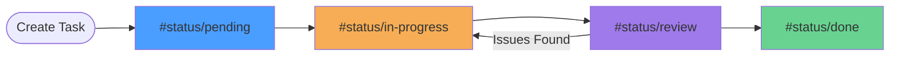
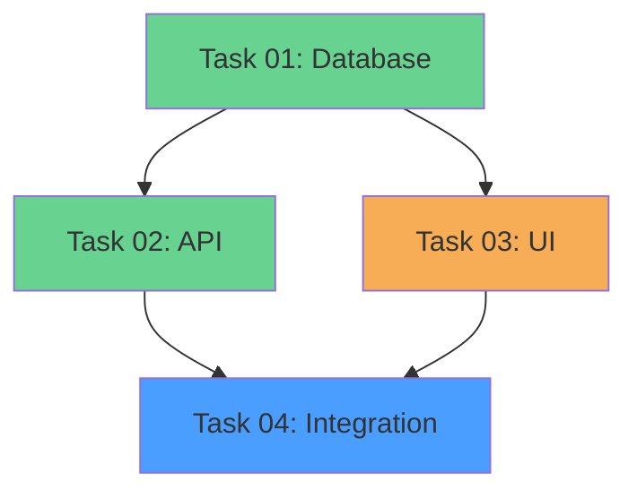

# Task Management

Advanced workflows for managing tasks in SpecTacular.

## Task Structure

### Task File Format

```markdown
---
type: task
status: pending
spec: [[authentication-spec]]
priority: high
assignee: @username
estimated: 4h
---

# Task Title

## Description
What needs to be done and why.

## Acceptance Criteria
- [ ] Criterion 1
- [ ] Criterion 2
- [ ] Criterion 3

## Implementation Notes
- Technical details
- Gotchas to watch for

## Dependencies
- Requires: [[task-01]]
- Blocks: [[task-03]]

## Testing
- [ ] Unit tests written
- [ ] Integration tests pass
```

### Task Overview (tasks.md)

```markdown
---
type: tasks
status: in-progress
spec: [[spec-name]]
---

# Feature Tasks

## Task Summary

| # | Task | Status | Assignee | Est. |
|---|------|--------|----------|------|
| 1 | [[task-01]] Setup | #status/done | @alice | 2h |
| 2 | [[task-02]] Implementation | #status/in-progress | @bob | 8h |
| 3 | [[task-03]] Testing | #status/pending | | 4h |

## Progress
- Total: 3
- Done: 1 (33%)
- In Progress: 1 (33%)
- Pending: 1 (33%)
```

## Auto-Status Updates

### How It Works

**Trigger:** Save task file with all criteria checked

**Before:**
```markdown
---
status: pending
---

## Acceptance Criteria
- [x] All
- [x] Criteria
- [x] Checked
```

**After:**
```markdown
---
status: done  # ← Automatically updated!
---

## Acceptance Criteria
- [x] All
- [x] Criteria
- [x] Checked
```

**Also Updates:**
- Parent `tasks.md` table: `#status/pending` → `#status/done`
- Status bar notification: "Task status updated to: done"

### Configuration

```json
{
  "spectacular.autoStatus.enabled": true,
  "spectacular.autoStatus.notifyOnChange": true
}
```

## Task Workflows

### Creating Tasks

**Method 1: From Spec**
```
# In Claude Code
/tasks

# Creates:
specs/###-feature/tasks.md
specs/###-feature/task-01.md
specs/###-feature/task-02.md
...
```

**Method 2: Manual**
1. Create `specs/###-feature/tasks/task-##.md`
2. Add frontmatter with `type: task`
3. Add acceptance criteria section
4. Save

**Method 3: From Template**
```bash
cp .spectacular/templates/task-template.md specs/###-feature/tasks/task-05.md
# Edit and customize
```

### Task Progression



### Updating Status

**Manual:**
```markdown
---
status: in-progress  # ← Change this
---
```

**Auto (via criteria):**
```markdown
## Acceptance Criteria
- [x] First criterion   # ← Check all
- [x] Second criterion  # ← boxes
- [x] Third criterion   # ← then save
```

**Via Table:**

In `tasks.md`:
```markdown
| 1 | [[task-01]] | #status/done | @alice |  # ← Update here
```

## Task Organization

### Directory Structure

**Flat (simple projects):**
```
specs/
└── 001-feature/
    ├── feature-spec.md
    ├── tasks.md
    ├── task-01.md
    ├── task-02.md
    └── task-03.md
```

**Nested (complex projects):**
```
specs/
└── 001-feature/
    ├── feature-spec.md
    ├── tasks.md
    └── tasks/
        ├── backend/
        │   ├── task-01-database.md
        │   └── task-02-api.md
        └── frontend/
            ├── task-03-ui.md
            └── task-04-integration.md
```

### Naming Conventions

**Recommended:**
- `task-01-descriptive-name.md`
- `task-backend-01-auth.md`
- `01-setup-database.md`

**Avoid:**
- `task1.md` (no leading zero)
- `TASK-01.md` (inconsistent casing)
- `my task.md` (spaces in filename)

## Task Tracking

### Progress Calculation

**In tasks.md:**
```markdown
## Progress
- Total: 8
- Done: 3 (38%)
- In Progress: 2 (25%)
- Pending: 3 (38%)
- Blocked: 0 (0%)
```

**Auto-calculate with script:**
```powershell
# .spectacular/scripts/powershell/calculate-progress.ps1
$tasks = Get-ChildItem tasks\*.md
$done = ($tasks | Select-String "status: done").Count
$total = $tasks.Count
Write-Host "Progress: $done/$total ($(($done/$total)*100)%)"
```

### Burndown Tracking

Create a burndown chart in spec:

```markdown
## Burndown

| Date | Remaining | Completed |
|------|-----------|-----------|
| 12/01 | 8 | 0 |
| 12/08 | 5 | 3 |
| 12/15 | 2 | 6 |
| 12/22 | 0 | 8 |
```

## Dependencies

### Specifying Dependencies

```markdown
## Dependencies
- **Requires:** [[task-01-database]], [[task-02-api]]
- **Blocks:** [[task-05-integration]]
- **Related:** [[task-03-testing]]
```

### Dependency Graph



### Tracking Blockers

```markdown
---
type: task
status: blocked
blocker: "Waiting for API design approval"
---

# Task 04: Integration

## Blockers
- [ ] API design approved
- [ ] Database migration complete

Once blockers resolved:
1. Update status to `pending`
2. Begin implementation
```

## Task Assignments

### Assigning Tasks

```markdown
---
assignee: @username
---
```

### Team View

Create `ASSIGNMENTS.md`:

```markdown
# Team Assignments

## @alice
- [[task-01]] Database Setup #status/done
- [[task-04]] API Endpoints #status/in-progress

## @bob
- [[task-02]] Frontend UI #status/in-progress
- [[task-05]] Testing #status/pending

## Unassigned
- [[task-03]] Documentation #status/pending
```

## Time Tracking

### Estimation

```markdown
---
estimated: 4h
---

## Time Estimate
- **Estimated:** 4 hours
- **Actual:** _(fill after completion)_
```

### Actual Time

```markdown
---
estimated: 4h
actual: 6h
---

## Time Log
- 12/22 10:00-12:00 (2h): Initial implementation
- 12/22 14:00-18:00 (4h): Bug fixes and testing
- **Total:** 6h (150% of estimate)
```

## Best Practices

### ✅ Do

- **Keep tasks atomic** - Each task = one logical unit of work
- **Write clear criteria** - Checkboxes should be specific and testable
- **Link related tasks** - Use wikilinks for dependencies
- **Update status regularly** - Keep task table current
- **Estimate realistically** - Track actual vs. estimated time

### ❌ Don't

- **Don't create mega-tasks** - Break down into smaller tasks
- **Don't skip criteria** - Every task needs acceptance criteria
- **Don't orphan tasks** - Link to parent spec
- **Don't forget testing** - Include test criteria
- **Don't leave blockers ambiguous** - Specify what's needed

## Advanced Workflows

### Kanban Board

Create `KANBAN.md`:

```markdown
# Kanban Board

## To Do
- [[task-03]]
- [[task-06]]

## In Progress
- [[task-02]]
- [[task-04]]

## Review
- [[task-01]]

## Done
- [[task-05]]
```

### Sprint Planning

```markdown
# Sprint 1 (12/01 - 12/15)

## Sprint Goal
Complete authentication feature

## Tasks
- [[task-01]] #status/done
- [[task-02]] #status/done
- [[task-03]] #status/in-progress ← Carry over to Sprint 2

## Velocity
- Planned: 20 points
- Completed: 16 points
- Velocity: 80%
```

### Recurring Tasks

Create template for recurring work:

```markdown
---
type: task
recurring: weekly
---

# Weekly: Update Dependencies

## Checklist
- [ ] Run `npm outdated`
- [ ] Review security advisories
- [ ] Update dependencies
- [ ] Run tests
- [ ] Commit changes
```

## Next Steps

- [Status Tags](./status-tags) - Status tag conventions
- [Specification Pipeline](./specification-pipeline) - Full workflow
- [Extension Features](/guide/extension/features) - Dashboard features
