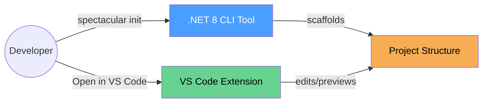

## Why SpecTacular?

Managing software specifications across multiple markdown files can be challenging:
- **Fragmented documentation** - Specs, plans, and tasks spread across many files
- **No visual hierarchy** - Plain text editors don't show document relationships
- **Manual navigation** - Jumping between linked files is tedious
- **No status visibility** - Task completion states buried in text

SpecTacular solves these problems with a powerful CLI scaffolding tool and an integrated VS Code extension.

## Quick Start

::: code-group

```powershell [Install CLI]
# One-liner installation
irm https://raw.githubusercontent.com/Tadzesi/SpecTacular/master/spectacular-cli/installer/install.ps1 | iex

# Verify
spectacular --version
```

```bash [Initialize Project]
# Scaffold a new spec-driven project
cd your-project
spectacular init --name "MyProject" --tech "Node.js, TypeScript"

# Opens project structure with AI workflow commands
```

```bash [Install VS Code Extension]
# Download from GitHub releases
# https://github.com/Tadzesi/SpecTacular/releases

# Install via command line
code --install-extension spectacular-dashboard-1.6.4.vsix
```

:::

## Architecture

SpecTacular consists of two main components:



**CLI Tool:** Scaffolds projects with templates, AI workflow commands, and configuration
**VS Code Extension:** Rich markdown preview, WYSIWYG editing, tree view, auto-status updates

[Learn more about the architecture →](/architecture/)

## What's Next?

<div class="vp-doc" style="margin-top: 2rem;">

**For Users:**
- [Installation Guide](/getting-started/) - Set up CLI and VS Code extension
- [CLI Commands](/guide/cli/commands) - Learn `init`, `update`, and more
- [Extension Features](/guide/extension/features) - Dashboard, tree view, WYSIWYG editor
- [Workflow Guide](/guide/workflows/specification-pipeline) - AI-assisted spec pipeline

**For Developers:**
- [Architecture Overview](/architecture/) - System design and component diagrams
- [Development Setup](/development/setup) - Build CLI and extension from source
- [Contributing Guide](/development/contributing) - How to contribute to SpecTacular
- [API Reference](/api/extension/) - Extension and webview API documentation

</div>
